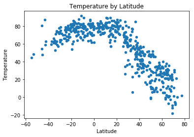
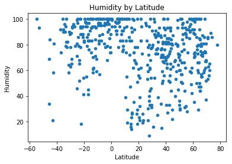
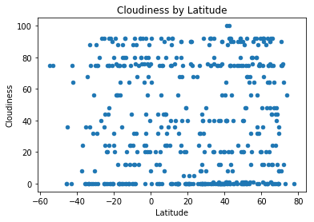
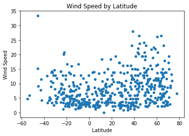
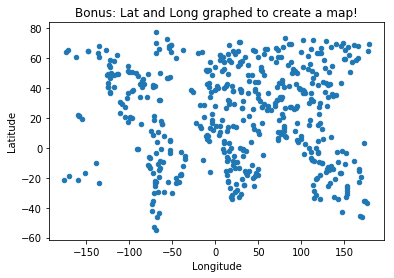

```python
print("Observation 1: Check out that beautifully grouped scatter! We can definitively say that it is warmer by the equator. Boom.")
print("Observation 2: A quick glance at processing list shows some real popular cities! Rikitea shows up 65 times, Busselton 32 times, Bluff 30 times. What gives? Well, these cities are SUPER isolated, so our methodology favors them. To combat this, I added the ~200m radius rule, should make our data a little more reliable.")
print("Observation 3: I was initially startled by the way the 'cloudiness' points are grouped, but then realized it must just increment by 5's, leading to clear bands of data.")
      
#Ok, there's two basic parts of this question. 1- Select 500 cities, 2- cycle through and grab temperature (and step 3, plot)
# It's part 1 that I'm worried about. Are we... selecting random Lat/Longs then finding a nearby city?
# that seems bad- we'll just be favoring coastal cities. I've got a different plan, outlined below, that should be more fair.

#Note long is -180 to 180, lat is -90 to 90
```

    Observation 1: Check out that beautifully grouped scatter! We can definitively say that it is warmer by the equator. Boom.
    Observation 2: A quick glance at processing list shows some real popular cities! Rikitea shows up 65 times, Busselton 32 times, Bluff 30 times. What gives? Well, these cities are SUPER isolated, so our methodology favors them. To combat this, I added the ~200m radius rule, should make our data a little more reliable.
    Observation 3: I was initially startled by the way the 'cloudiness' points are grouped, but then realized it must just increment by 5's, leading to clear bands of data.
    


```python
#import our libraries- I'm think random, citypy, and whatever lets us grab the weather api. +config, obvi.
import openweathermapy.core as owm
import pandas as pd
import random
import matplotlib as plt
import urllib
from citipy import citipy
#from config import api_weather - ok, so, normally this would be great. But, for github, let's allow user to input
api_weather = input("Please enter your Open Weather Map API Key: ")

#establish the weather settings, let's use Farenheit
settings = {"units": "imperial", "appid": api_weather}
```

    Please enter your Open Weather Map API Key: 11cbc60ffa918667a87fbe4db77d4ecb
    


```python
#In order to avoid enormous Pacific sinkholes of data, I'd like to limit our findings further to cities within 200 miles of coords.
#Let's do this:
    #counter =0
    #latitude_list=[]
    #temp_list=[]
    #whole counter = <500
        #Randomly generate coords
        #Find a nearby city with citypy
        #If city is within 200 miles:   <-----------
            #Try to send city to temp API
                #Exceptions for if the city can't be found
            #record lattitude
            #record temp
            #counter=counter+1
            
```


```python
counter = 0
attempts = 0
city_list = []
temp_list = []
humidity_list = []
cloudiness_list = []
windspeed_list = []
lat_list = []
lon_list = []

while counter < 500:
    attempts = attempts + 1
    lat = random.uniform(-90,90)
    lon = random.uniform(-180,180)
    city = citipy.nearest_city(lat,lon)
    if city.city_name in city_list:
        print("{}: {} is already in our list!".format(attempts, city.city_name))
    else:
        try:
            new_weather = owm.get_current(city.city_name + "," + city.country_code, **settings)
        except urllib.error.HTTPError:
            print("{}: {} not found in OWM.".format(attempts, city.city_name)) 
            continue
        if (abs(new_weather['coord']['lon'] - lon) <10 and  #lines of longitude vary a lot. at +/-60, a degree is about ~34 miles. 34*6= 204 miles
        abs(new_weather['coord']['lat'] - lat) <4): #lines of lattitude are pretty constant- 3 degrees will be ~68*3 - 204 miles apart
            city_list.append(city.city_name)
            temp_list.append(new_weather['main']['temp'])
            humidity_list.append(new_weather['main']['humidity'])
            cloudiness_list.append(new_weather['clouds']['all'])
            windspeed_list.append(new_weather['wind']['speed'])
            lat_list.append(new_weather['coord']['lat'])
            lon_list.append(new_weather['coord']['lon'])
            counter = counter+1
            print("{}: Adding {} to our list.".format(attempts, city.city_name))
        else:
            print("{}: {} is too far from the generated coordinates.".format(attempts, city.city_name))
weather_dict = {"City":city_list, "Temperature":temp_list, "Latitude": lat_list, "Longitude":lon_list, "Humidity":humidity_list, "Cloudiness":cloudiness_list, "Wind Speed":windspeed_list}
weather_df = pd.DataFrame(weather_dict)
weather_df
print("It took {} calls to retrieve this data.".format(attempts))
        
```

    1: Adding atuona to our list.
    2: yellowknife is too far from the generated coordinates.
    3: Adding isangel to our list.
    4: hilo is too far from the generated coordinates.
    5: mataura not found in OWM.
    6: Adding santa marta to our list.
    7: Adding port blair to our list.
    8: punta arenas is too far from the generated coordinates.
    9: atuona is already in our list!
    10: ushuaia is too far from the generated coordinates.
    11: Adding ucluelet to our list.
    12: Adding faanui to our list.
    13: castro is too far from the generated coordinates.
    14: bluff is too far from the generated coordinates.
    15: Adding pacific grove to our list.
    16: Adding marystown to our list.
    17: laguna not found in OWM.
    18: oktyabrskoye is too far from the generated coordinates.
    19: busselton is too far from the generated coordinates.
    20: Adding zhigansk to our list.
    21: port alfred is too far from the generated coordinates.
    22: Adding victoria to our list.
    23: Adding busselton to our list.
    24: punta arenas is too far from the generated coordinates.
    25: Adding nyurba to our list.
    26: mataura not found in OWM.
    27: Adding cherskiy to our list.
    28: illoqqortoormiut not found in OWM.
    29: tiksi is too far from the generated coordinates.
    30: laurel is too far from the generated coordinates.
    31: bluff is too far from the generated coordinates.
    32: klaksvik is too far from the generated coordinates.
    33: barrow is too far from the generated coordinates.
    34: bluff is too far from the generated coordinates.
    35: helong is too far from the generated coordinates.
    36: Adding lola to our list.
    37: rikitea is too far from the generated coordinates.
    38: Adding goundam to our list.
    39: hobart is too far from the generated coordinates.
    40: Adding petatlan to our list.
    41: Adding bethel to our list.
    42: vestmannaeyjar is too far from the generated coordinates.
    43: yellowknife is too far from the generated coordinates.
    44: guerrero negro is too far from the generated coordinates.
    45: ushuaia is too far from the generated coordinates.
    46: toliary not found in OWM.
    47: hobart is too far from the generated coordinates.
    48: cherskiy is already in our list!
    49: rikitea is too far from the generated coordinates.
    50: Adding ahipara to our list.
    51: Adding butembo to our list.
    52: saint-philippe is too far from the generated coordinates.
    53: olafsvik not found in OWM.
    54: mataura not found in OWM.
    55: butaritari is too far from the generated coordinates.
    56: sao filipe is too far from the generated coordinates.
    57: mataura not found in OWM.
    58: yellowknife is too far from the generated coordinates.
    59: belmonte is too far from the generated coordinates.
    60: Adding saint george to our list.
    61: Adding baiyin to our list.
    62: carnarvon is too far from the generated coordinates.
    63: cidreira is too far from the generated coordinates.
    64: illoqqortoormiut not found in OWM.
    65: sobolevo is too far from the generated coordinates.
    66: punta arenas is too far from the generated coordinates.
    67: hobart is too far from the generated coordinates.
    68: Adding bergen to our list.
    69: Adding kununurra to our list.
    70: mys shmidta not found in OWM.
    71: albany is too far from the generated coordinates.
    72: kruisfontein is too far from the generated coordinates.
    73: hermanus is too far from the generated coordinates.
    74: kodiak is too far from the generated coordinates.
    75: jamestown is too far from the generated coordinates.
    76: Adding ribeira grande to our list.
    77: Adding korla to our list.
    78: Adding gohpur to our list.
    79: deputatskiy is too far from the generated coordinates.
    80: Adding port-gentil to our list.
    81: yichun is too far from the generated coordinates.
    82: Adding majene to our list.
    83: amderma not found in OWM.
    84: Adding mangan to our list.
    85: albany is too far from the generated coordinates.
    86: rikitea is too far from the generated coordinates.
    87: rikitea is too far from the generated coordinates.
    88: khatanga is too far from the generated coordinates.
    89: Adding conde to our list.
    90: betioky not found in OWM.
    91: rikitea is too far from the generated coordinates.
    92: Adding kattivakkam to our list.
    93: port elizabeth is too far from the generated coordinates.
    94: Adding la rioja to our list.
    95: Adding sauce to our list.
    96: Adding cervo to our list.
    97: cayenne is too far from the generated coordinates.
    98: Adding baruun-urt to our list.
    99: qaanaaq is too far from the generated coordinates.
    100: belushya guba not found in OWM.
    101: Adding iqaluit to our list.
    102: prince rupert is too far from the generated coordinates.
    103: rocha is too far from the generated coordinates.
    104: ahipara is already in our list!
    105: talnakh is too far from the generated coordinates.
    106: praia da vitoria is too far from the generated coordinates.
    107: butaritari is too far from the generated coordinates.
    108: busselton is already in our list!
    109: kerteh not found in OWM.
    110: Adding muros to our list.
    111: Adding camargo to our list.
    112: punta arenas is too far from the generated coordinates.
    113: Adding sola to our list.
    114: port elizabeth is too far from the generated coordinates.
    115: hithadhoo is too far from the generated coordinates.
    116: Adding damietta to our list.
    117: hithadhoo is too far from the generated coordinates.
    118: itarema is too far from the generated coordinates.
    119: Adding saskylakh to our list.
    120: Adding kalmunai to our list.
    121: ushuaia is too far from the generated coordinates.
    122: busselton is already in our list!
    123: Adding meulaboh to our list.
    124: Adding hervey bay to our list.
    125: upernavik is too far from the generated coordinates.
    126: yellowknife is too far from the generated coordinates.
    127: mys shmidta not found in OWM.
    128: san patricio is too far from the generated coordinates.
    129: illoqqortoormiut not found in OWM.
    130: Adding buraydah to our list.
    131: east london is too far from the generated coordinates.
    132: Adding boyolangu to our list.
    133: Adding nadym to our list.
    134: hobart is too far from the generated coordinates.
    135: grand gaube is too far from the generated coordinates.
    136: taolanaro not found in OWM.
    137: vila franca do campo is too far from the generated coordinates.
    138: Adding surovikino to our list.
    139: kapaa is too far from the generated coordinates.
    140: ushuaia is too far from the generated coordinates.
    141: atuona is already in our list!
    142: alotau not found in OWM.
    143: Adding georgetown to our list.
    144: port alfred is too far from the generated coordinates.
    145: Adding khasan to our list.
    146: mar del plata is too far from the generated coordinates.
    147: cape town is too far from the generated coordinates.
    148: saint-philippe is too far from the generated coordinates.
    149: mataura not found in OWM.
    150: rikitea is too far from the generated coordinates.
    151: nelson bay is too far from the generated coordinates.
    152: busselton is already in our list!
    153: hithadhoo is too far from the generated coordinates.
    154: mataura not found in OWM.
    155: hilo is too far from the generated coordinates.
    156: cervo is already in our list!
    157: fortuna is too far from the generated coordinates.
    158: angra not found in OWM.
    159: saint george is already in our list!
    160: belushya guba not found in OWM.
    161: thompson is too far from the generated coordinates.
    162: rikitea is too far from the generated coordinates.
    163: sitka is too far from the generated coordinates.
    164: klaksvik is too far from the generated coordinates.
    165: ushuaia is too far from the generated coordinates.
    166: Adding rikitea to our list.
    167: barrow is too far from the generated coordinates.
    168: vaitupu not found in OWM.
    169: new norfolk is too far from the generated coordinates.
    170: yellowknife is too far from the generated coordinates.
    171: mataura not found in OWM.
    172: Adding biltine to our list.
    173: Adding skagen to our list.
    174: tasiilaq is too far from the generated coordinates.
    175: akyab not found in OWM.
    176: Adding ossora to our list.
    177: taolanaro not found in OWM.
    178: Adding east longmeadow to our list.
    179: new norfolk is too far from the generated coordinates.
    180: kropotkin is too far from the generated coordinates.
    181: cabo san lucas is too far from the generated coordinates.
    182: Adding ayorou to our list.
    183: Adding eureka to our list.
    184: busselton is already in our list!
    185: barentsburg not found in OWM.
    186: Adding cairns to our list.
    187: Adding novyy urgal to our list.
    188: punta arenas is too far from the generated coordinates.
    189: Adding bandarbeyla to our list.
    190: mar del plata is too far from the generated coordinates.
    191: khatanga is too far from the generated coordinates.
    192: Adding san juan de la maguana to our list.
    193: Adding port hedland to our list.
    194: chokurdakh is too far from the generated coordinates.
    195: ushuaia is too far from the generated coordinates.
    196: tuktoyaktuk is too far from the generated coordinates.
    197: rikitea is already in our list!
    198: Adding umred to our list.
    199: mahebourg is too far from the generated coordinates.
    200: hermanus is too far from the generated coordinates.
    201: rikitea is already in our list!
    202: vila velha is too far from the generated coordinates.
    203: punta arenas is too far from the generated coordinates.
    204: sentyabrskiy not found in OWM.
    205: kodiak is too far from the generated coordinates.
    206: longyearbyen is too far from the generated coordinates.
    207: mataura not found in OWM.
    208: vestmannaeyjar is too far from the generated coordinates.
    209: souillac is too far from the generated coordinates.
    210: bereda not found in OWM.
    211: Adding waingapu to our list.
    212: rikitea is already in our list!
    213: ushuaia is too far from the generated coordinates.
    214: Adding punta arenas to our list.
    215: Adding misratah to our list.
    216: Adding portree to our list.
    217: busselton is already in our list!
    218: nishihara is too far from the generated coordinates.
    219: port alfred is too far from the generated coordinates.
    220: norman wells is too far from the generated coordinates.
    221: hilo is too far from the generated coordinates.
    222: torbay is too far from the generated coordinates.
    223: kapaa is too far from the generated coordinates.
    224: Adding taltal to our list.
    225: ust-kamchatsk not found in OWM.
    226: Adding matadi to our list.
    227: mount gambier is too far from the generated coordinates.
    228: kapaa is too far from the generated coordinates.
    229: Adding qaanaaq to our list.
    230: Adding pollachi to our list.
    231: Adding khuzhir to our list.
    232: Adding pisco to our list.
    233: kodiak is too far from the generated coordinates.
    234: tsihombe not found in OWM.
    235: bredasdorp is too far from the generated coordinates.
    236: new norfolk is too far from the generated coordinates.
    237: tingrela not found in OWM.
    238: busselton is already in our list!
    239: yellowknife is too far from the generated coordinates.
    240: saint-philippe is too far from the generated coordinates.
    241: Adding jamestown to our list.
    242: sentyabrskiy not found in OWM.
    243: belyy yar is too far from the generated coordinates.
    244: Adding fort-shevchenko to our list.
    245: Adding chabahar to our list.
    246: Adding mayo to our list.
    247: quincy is too far from the generated coordinates.
    248: Adding kaohsiung to our list.
    249: Adding mwanza to our list.
    250: Adding shenjiamen to our list.
    251: ust-kamchatsk not found in OWM.
    252: ushuaia is too far from the generated coordinates.
    253: atuona is already in our list!
    254: jamestown is already in our list!
    255: bababe not found in OWM.
    256: tsihombe not found in OWM.
    257: tiksi is too far from the generated coordinates.
    258: Adding lapua to our list.
    259: college is too far from the generated coordinates.
    260: boyolangu is already in our list!
    261: jamestown is already in our list!
    262: sao filipe is too far from the generated coordinates.
    263: puerto ayora is too far from the generated coordinates.
    264: Adding butaritari to our list.
    265: Adding podporozhye to our list.
    266: Adding mildura to our list.
    267: Adding naze to our list.
    268: bredasdorp is too far from the generated coordinates.
    269: bluff is too far from the generated coordinates.
    270: ixtapa is too far from the generated coordinates.
    271: Adding kontagora to our list.
    272: touros is too far from the generated coordinates.
    273: upernavik is too far from the generated coordinates.
    274: bengkulu not found in OWM.
    275: tabiauea not found in OWM.
    276: kaitangata is too far from the generated coordinates.
    277: changji is too far from the generated coordinates.
    278: Adding hami to our list.
    279: kodiak is too far from the generated coordinates.
    280: punta arenas is already in our list!
    281: nishihara is too far from the generated coordinates.
    282: Adding corum to our list.
    283: barentsburg not found in OWM.
    284: Adding sioux lookout to our list.
    285: Adding taoudenni to our list.
    286: Adding port keats to our list.
    287: hermanus is too far from the generated coordinates.
    288: akyab not found in OWM.
    289: bambous virieux is too far from the generated coordinates.
    290: Adding lavrentiya to our list.
    291: Adding varhaug to our list.
    292: illoqqortoormiut not found in OWM.
    293: illoqqortoormiut not found in OWM.
    294: faanui is already in our list!
    295: vila velha is too far from the generated coordinates.
    296: saint anthony not found in OWM.
    297: Adding reconquista to our list.
    298: punta arenas is already in our list!
    299: kaitangata is too far from the generated coordinates.
    300: upernavik is too far from the generated coordinates.
    301: fairbanks is too far from the generated coordinates.
    302: Adding luanda to our list.
    303: sioux lookout is already in our list!
    304: warqla not found in OWM.
    305: rawson is too far from the generated coordinates.
    306: Adding askiz to our list.
    307: albany is too far from the generated coordinates.
    308: albany is too far from the generated coordinates.
    309: georgetown is already in our list!
    310: vaini is too far from the generated coordinates.
    311: sentyabrskiy not found in OWM.
    312: mar del plata is too far from the generated coordinates.
    313: Adding kalur kot to our list.
    314: port alfred is too far from the generated coordinates.
    315: puerto ayora is too far from the generated coordinates.
    316: bengkulu not found in OWM.
    317: Adding boromo to our list.
    318: rikitea is already in our list!
    319: tuktoyaktuk is too far from the generated coordinates.
    320: lebu is too far from the generated coordinates.
    321: puerto ayora is too far from the generated coordinates.
    322: ushuaia is too far from the generated coordinates.
    323: arraial do cabo is too far from the generated coordinates.
    324: ushuaia is too far from the generated coordinates.
    325: belushya guba not found in OWM.
    326: Adding auki to our list.
    327: Adding durres to our list.
    328: avarua is too far from the generated coordinates.
    329: attawapiskat not found in OWM.
    330: norman wells is too far from the generated coordinates.
    331: leningradskiy is too far from the generated coordinates.
    332: Adding leua to our list.
    333: codrington not found in OWM.
    334: sitka is too far from the generated coordinates.
    335: Adding anzio to our list.
    336: taolanaro not found in OWM.
    337: Adding pastavy to our list.
    338: saint-augustin is too far from the generated coordinates.
    339: Adding daru to our list.
    340: lompoc is too far from the generated coordinates.
    341: new norfolk is too far from the generated coordinates.
    342: bredasdorp is too far from the generated coordinates.
    343: Adding kuah to our list.
    344: rikitea is already in our list!
    345: ushuaia is too far from the generated coordinates.
    346: puerto ayora is too far from the generated coordinates.
    347: ushuaia is too far from the generated coordinates.
    348: lorengau is too far from the generated coordinates.
    349: rikitea is already in our list!
    350: Adding deputatskiy to our list.
    351: Adding markala to our list.
    352: Adding alice springs to our list.
    353: Adding vizinga to our list.
    354: arraial do cabo is too far from the generated coordinates.
    355: Adding muhos to our list.
    356: rikitea is already in our list!
    357: saint-augustin is too far from the generated coordinates.
    358: kapaa is too far from the generated coordinates.
    359: Adding caarapo to our list.
    360: tiksi is too far from the generated coordinates.
    361: hermanus is too far from the generated coordinates.
    362: Adding premia de mar to our list.
    363: chuy is too far from the generated coordinates.
    364: punta arenas is already in our list!
    365: pisco is already in our list!
    366: katsuura is too far from the generated coordinates.
    367: hermanus is too far from the generated coordinates.
    368: leningradskiy is too far from the generated coordinates.
    369: east london is too far from the generated coordinates.
    370: norman wells is too far from the generated coordinates.
    371: vaini is too far from the generated coordinates.
    372: georgetown is already in our list!
    373: Adding lebu to our list.
    374: Adding kapaa to our list.
    375: pacific grove is already in our list!
    376: Adding yulara to our list.
    377: honiara is too far from the generated coordinates.
    378: marcona not found in OWM.
    379: san vicente is too far from the generated coordinates.
    380: bac lieu not found in OWM.
    381: muros is already in our list!
    382: mahebourg is too far from the generated coordinates.
    383: Adding coquimbo to our list.
    384: Adding palauig to our list.
    385: carnarvon is too far from the generated coordinates.
    386: santa isabel not found in OWM.
    387: albany is too far from the generated coordinates.
    388: Adding alcudia to our list.
    389: Adding cabra to our list.
    390: Adding kangaatsiaq to our list.
    391: cherskiy is already in our list!
    392: Adding thessalon to our list.
    393: taolanaro not found in OWM.
    394: Adding vila franca do campo to our list.
    395: illoqqortoormiut not found in OWM.
    396: Adding jiuquan to our list.
    397: Adding qasigiannguit to our list.
    398: khani not found in OWM.
    399: bambous virieux is too far from the generated coordinates.
    400: castro is too far from the generated coordinates.
    401: leningradskiy is too far from the generated coordinates.
    402: kodiak is too far from the generated coordinates.
    403: palabuhanratu not found in OWM.
    404: coquimbo is already in our list!
    405: kapaa is already in our list!
    406: payo not found in OWM.
    407: avarua is too far from the generated coordinates.
    408: Adding awbari to our list.
    409: taolanaro not found in OWM.
    410: tuktoyaktuk is too far from the generated coordinates.
    411: pevek is too far from the generated coordinates.
    412: lebu is already in our list!
    413: Adding severo-kurilsk to our list.
    414: saskylakh is already in our list!
    415: tasiilaq is too far from the generated coordinates.
    416: Adding kosh-agach to our list.
    417: Adding khatanga to our list.
    418: zhigansk is already in our list!
    419: Adding srednekolymsk to our list.
    420: hobart is too far from the generated coordinates.
    421: Adding clyde river to our list.
    422: Adding mitsamiouli to our list.
    423: padang is too far from the generated coordinates.
    424: Adding sayyan to our list.
    425: dikson is too far from the generated coordinates.
    426: vaini is too far from the generated coordinates.
    427: hirara is too far from the generated coordinates.
    428: bluff is too far from the generated coordinates.
    429: vila velha is too far from the generated coordinates.
    430: ruatoria not found in OWM.
    431: taolanaro not found in OWM.
    432: Adding kuytun to our list.
    433: barentsburg not found in OWM.
    434: cape town is too far from the generated coordinates.
    435: hasanabad not found in OWM.
    436: Adding namibe to our list.
    437: Adding arlit to our list.
    438: Adding kutum to our list.
    439: tuktoyaktuk is too far from the generated coordinates.
    440: port elizabeth is too far from the generated coordinates.
    441: san cristobal is too far from the generated coordinates.
    442: Adding lorengau to our list.
    443: komsomolskiy is too far from the generated coordinates.
    444: hermanus is too far from the generated coordinates.
    445: rikitea is already in our list!
    446: norman wells is too far from the generated coordinates.
    447: Adding racine to our list.
    448: Adding kovur to our list.
    449: rikitea is already in our list!
    450: airai not found in OWM.
    451: barentsburg not found in OWM.
    452: Adding north myrtle beach to our list.
    453: Adding kysyl-syr to our list.
    454: acarau not found in OWM.
    455: kapaa is already in our list!
    456: ipixuna is too far from the generated coordinates.
    457: marcona not found in OWM.
    458: Adding caborca to our list.
    459: rikitea is already in our list!
    460: taolanaro not found in OWM.
    461: Adding verkhnyaya inta to our list.
    462: Adding guarda to our list.
    463: nanakuli is too far from the generated coordinates.
    464: Adding magadi to our list.
    465: hilo is too far from the generated coordinates.
    466: bluff is too far from the generated coordinates.
    467: saint george is already in our list!
    468: sahrak not found in OWM.
    469: mahebourg is too far from the generated coordinates.
    470: vaini is too far from the generated coordinates.
    471: Adding anadyr to our list.
    472: Adding idritsa to our list.
    473: la ronge is too far from the generated coordinates.
    474: ixtapa is too far from the generated coordinates.
    475: Adding skibbereen to our list.
    476: punta arenas is already in our list!
    477: arraial do cabo is too far from the generated coordinates.
    478: east london is too far from the generated coordinates.
    479: Adding ostrov to our list.
    480: saint-philippe is too far from the generated coordinates.
    481: Adding yumen to our list.
    482: ondorhaan not found in OWM.
    483: sao filipe is too far from the generated coordinates.
    484: takoradi is too far from the generated coordinates.
    485: gat not found in OWM.
    486: Adding kamsack to our list.
    487: kapaa is already in our list!
    488: Adding bucerias to our list.
    489: avarua is too far from the generated coordinates.
    490: avarua is too far from the generated coordinates.
    491: qaanaaq is already in our list!
    492: taolanaro not found in OWM.
    493: saskylakh is already in our list!
    494: sitka is too far from the generated coordinates.
    495: Adding macenta to our list.
    496: burica not found in OWM.
    497: Adding nanakuli to our list.
    498: barrow is too far from the generated coordinates.
    499: puerto ayora is too far from the generated coordinates.
    500: codrington not found in OWM.
    501: biak is too far from the generated coordinates.
    502: Adding talnakh to our list.
    503: hamilton is too far from the generated coordinates.
    504: samalaeulu not found in OWM.
    505: new norfolk is too far from the generated coordinates.
    506: Adding inirida to our list.
    507: Adding henties bay to our list.
    508: busselton is already in our list!
    509: mataura not found in OWM.
    510: barrow is too far from the generated coordinates.
    511: Adding zyryanka to our list.
    512: puerto ayora is too far from the generated coordinates.
    513: shimoda is too far from the generated coordinates.
    514: mar del plata is too far from the generated coordinates.
    515: lavrentiya is already in our list!
    516: ushuaia is too far from the generated coordinates.
    517: thompson is too far from the generated coordinates.
    518: Adding bontang to our list.
    519: rikitea is already in our list!
    520: hofn is too far from the generated coordinates.
    521: Adding namatanai to our list.
    522: Adding tyn nad vltavou to our list.
    523: sindand not found in OWM.
    524: hobart is too far from the generated coordinates.
    525: portland is too far from the generated coordinates.
    526: Adding caravelas to our list.
    527: Adding batagay to our list.
    528: ushuaia is too far from the generated coordinates.
    529: busselton is already in our list!
    530: atuona is already in our list!
    531: georgetown is already in our list!
    532: Adding catia la mar to our list.
    533: Adding bama to our list.
    534: rikitea is already in our list!
    535: hithadhoo is too far from the generated coordinates.
    536: provideniya is too far from the generated coordinates.
    537: Adding marica to our list.
    538: attawapiskat not found in OWM.
    539: ushuaia is too far from the generated coordinates.
    540: Adding nanortalik to our list.
    541: cherskiy is already in our list!
    542: khatanga is already in our list!
    543: guerrero negro is too far from the generated coordinates.
    544: hilo is too far from the generated coordinates.
    545: quatre cocos is too far from the generated coordinates.
    546: new norfolk is too far from the generated coordinates.
    547: taolanaro not found in OWM.
    548: tasiilaq is too far from the generated coordinates.
    549: cherskiy is already in our list!
    550: Adding yar-sale to our list.
    551: jamestown is already in our list!
    552: Adding tirumullaivasal to our list.
    553: busselton is already in our list!
    554: dudinka is too far from the generated coordinates.
    555: cabo san lucas is too far from the generated coordinates.
    556: Adding kloulklubed to our list.
    557: stoyba not found in OWM.
    558: port lincoln is too far from the generated coordinates.
    559: Adding ormara to our list.
    560: castro is too far from the generated coordinates.
    561: vaini is too far from the generated coordinates.
    562: Adding chiredzi to our list.
    563: ushuaia is too far from the generated coordinates.
    564: Adding nagato to our list.
    565: jamestown is already in our list!
    566: Adding broome to our list.
    567: nizhneyansk not found in OWM.
    568: Adding shubarkuduk to our list.
    569: Adding constitucion to our list.
    570: saskylakh is already in our list!
    571: geraldton is too far from the generated coordinates.
    572: mys shmidta not found in OWM.
    573: Adding talegaon dabhade to our list.
    574: sorland is too far from the generated coordinates.
    575: busselton is already in our list!
    576: lasa not found in OWM.
    577: clyde river is already in our list!
    578: illoqqortoormiut not found in OWM.
    579: Adding morlaix to our list.
    580: tsihombe not found in OWM.
    581: ushuaia is too far from the generated coordinates.
    582: Adding sarakhs to our list.
    583: wanderlandia not found in OWM.
    584: mataura not found in OWM.
    585: hermanus is too far from the generated coordinates.
    586: Adding whitehorse to our list.
    587: Adding hilo to our list.
    588: taolanaro not found in OWM.
    589: Adding yabassi to our list.
    590: Adding tura to our list.
    591: Adding kenitra to our list.
    592: cidreira is too far from the generated coordinates.
    593: qaanaaq is already in our list!
    594: ushuaia is too far from the generated coordinates.
    595: Adding pointe-noire to our list.
    596: dingle is too far from the generated coordinates.
    597: Adding pontiac to our list.
    598: anadyr is already in our list!
    599: Adding ilulissat to our list.
    600: torbay is too far from the generated coordinates.
    601: saint-philippe is too far from the generated coordinates.
    602: chokurdakh is too far from the generated coordinates.
    603: Adding awjilah to our list.
    604: reefton not found in OWM.
    605: Adding almeirim to our list.
    606: kaitangata is too far from the generated coordinates.
    607: yellowknife is too far from the generated coordinates.
    608: Adding energeticheskiy to our list.
    609: hobart is too far from the generated coordinates.
    610: atuona is already in our list!
    611: new norfolk is too far from the generated coordinates.
    612: ribeira grande is already in our list!
    613: kruisfontein is too far from the generated coordinates.
    614: Adding progreso to our list.
    615: mataura not found in OWM.
    616: mataura not found in OWM.
    617: port alfred is too far from the generated coordinates.
    618: saint george is already in our list!
    619: hermanus is too far from the generated coordinates.
    620: Adding howard springs to our list.
    621: kavieng is too far from the generated coordinates.
    622: new norfolk is too far from the generated coordinates.
    623: esperance is too far from the generated coordinates.
    624: albany is too far from the generated coordinates.
    625: Adding totskoye to our list.
    626: severo-kurilsk is already in our list!
    627: albany is too far from the generated coordinates.
    628: tasiilaq is too far from the generated coordinates.
    629: provideniya is too far from the generated coordinates.
    630: pandan is too far from the generated coordinates.
    631: ewa beach is too far from the generated coordinates.
    632: saskylakh is already in our list!
    633: ponta delgada is too far from the generated coordinates.
    634: ilulissat is already in our list!
    635: longyearbyen is too far from the generated coordinates.
    636: ushuaia is too far from the generated coordinates.
    637: Adding manjacaze to our list.
    638: albany is too far from the generated coordinates.
    639: rikitea is already in our list!
    640: bengkulu not found in OWM.
    641: albany is too far from the generated coordinates.
    642: tuktoyaktuk is too far from the generated coordinates.
    643: ushuaia is too far from the generated coordinates.
    644: tuatapere is too far from the generated coordinates.
    645: Adding half moon bay to our list.
    646: hermanus is too far from the generated coordinates.
    647: nizhneyansk not found in OWM.
    648: ushuaia is too far from the generated coordinates.
    649: vaini is too far from the generated coordinates.
    650: saskylakh is already in our list!
    651: hermanus is too far from the generated coordinates.
    652: Adding mecca to our list.
    653: buariki not found in OWM.
    654: Adding visby to our list.
    655: mataura not found in OWM.
    656: port elizabeth is too far from the generated coordinates.
    657: bluff is too far from the generated coordinates.
    658: Adding vaini to our list.
    659: kutum is already in our list!
    660: Adding anju to our list.
    661: bluff is too far from the generated coordinates.
    662: butaritari is already in our list!
    663: Adding araouane to our list.
    664: busselton is already in our list!
    665: rikitea is already in our list!
    666: jamestown is already in our list!
    667: maridi not found in OWM.
    668: saint-joseph is too far from the generated coordinates.
    669: longyearbyen is too far from the generated coordinates.
    670: chokurdakh is too far from the generated coordinates.
    671: saint george is already in our list!
    672: jardim is too far from the generated coordinates.
    673: khatanga is already in our list!
    674: nikolskoye is too far from the generated coordinates.
    675: arraial do cabo is too far from the generated coordinates.
    676: ulladulla is too far from the generated coordinates.
    677: Adding katherine to our list.
    678: pemangkat not found in OWM.
    679: rikitea is already in our list!
    680: dingle is too far from the generated coordinates.
    681: ushuaia is too far from the generated coordinates.
    682: taolanaro not found in OWM.
    683: Adding dingle to our list.
    684: khatanga is already in our list!
    685: bengkulu not found in OWM.
    686: Adding cullman to our list.
    687: pevek is too far from the generated coordinates.
    688: Adding burdur to our list.
    689: Adding todos santos to our list.
    690: albany is too far from the generated coordinates.
    691: saint-philippe is too far from the generated coordinates.
    692: Adding verkhnevilyuysk to our list.
    693: taolanaro not found in OWM.
    694: Adding upernavik to our list.
    695: Adding poykovskiy to our list.
    696: narsaq is too far from the generated coordinates.
    697: Adding christiana to our list.
    698: Adding mareeba to our list.
    699: pisco is already in our list!
    700: khatanga is already in our list!
    701: Adding castro to our list.
    702: bambous virieux is too far from the generated coordinates.
    703: busselton is already in our list!
    704: albany is too far from the generated coordinates.
    705: butaritari is already in our list!
    706: Adding trinidad to our list.
    707: longyearbyen is too far from the generated coordinates.
    708: Adding buedu to our list.
    709: hobart is too far from the generated coordinates.
    710: ushuaia is too far from the generated coordinates.
    711: hilo is already in our list!
    712: new norfolk is too far from the generated coordinates.
    713: airai not found in OWM.
    714: jamestown is already in our list!
    715: mataura not found in OWM.
    716: cabo san lucas is too far from the generated coordinates.
    717: Adding cockburn town to our list.
    718: Adding menongue to our list.
    719: butaritari is already in our list!
    720: vardo is too far from the generated coordinates.
    721: puerto escondido is too far from the generated coordinates.
    722: saint-philippe is too far from the generated coordinates.
    723: qaqortoq is too far from the generated coordinates.
    724: guerrero negro is too far from the generated coordinates.
    725: bengkulu not found in OWM.
    726: kapaa is already in our list!
    727: victoria is already in our list!
    728: ilulissat is already in our list!
    729: nikolskoye is too far from the generated coordinates.
    730: rikitea is already in our list!
    731: cape town is too far from the generated coordinates.
    732: hermanus is too far from the generated coordinates.
    733: busselton is already in our list!
    734: punta arenas is already in our list!
    735: ushuaia is too far from the generated coordinates.
    736: espanola is too far from the generated coordinates.
    737: lagoa is too far from the generated coordinates.
    738: mahebourg is too far from the generated coordinates.
    739: kapaa is already in our list!
    740: Adding chengannur to our list.
    741: mataura not found in OWM.
    742: rikitea is already in our list!
    743: saint-philippe is too far from the generated coordinates.
    744: Adding torbay to our list.
    745: padang is too far from the generated coordinates.
    746: thompson is too far from the generated coordinates.
    747: Adding cayenne to our list.
    748: dikson is too far from the generated coordinates.
    749: Adding northam to our list.
    750: arraial do cabo is too far from the generated coordinates.
    751: ribeira grande is already in our list!
    752: olafsvik not found in OWM.
    753: iqaluit is already in our list!
    754: illoqqortoormiut not found in OWM.
    755: Adding troitsko-pechorsk to our list.
    756: atuona is already in our list!
    757: Adding perevolotskiy to our list.
    758: hobart is too far from the generated coordinates.
    759: hobart is too far from the generated coordinates.
    760: cherskiy is already in our list!
    761: georgetown is already in our list!
    762: punta arenas is already in our list!
    763: punta arenas is already in our list!
    764: coquimbo is already in our list!
    765: Adding thunder bay to our list.
    766: goderich not found in OWM.
    767: Adding canals to our list.
    768: Adding xai-xai to our list.
    769: torbay is already in our list!
    770: Adding nongpoh to our list.
    771: Adding samarai to our list.
    772: arraial do cabo is too far from the generated coordinates.
    773: bredasdorp is too far from the generated coordinates.
    774: atuona is already in our list!
    775: sentyabrskiy not found in OWM.
    776: Adding maloy to our list.
    777: Adding sao paulo de olivenca to our list.
    778: punta arenas is already in our list!
    779: atuona is already in our list!
    780: busselton is already in our list!
    781: kapaa is already in our list!
    782: Adding barkhan to our list.
    783: tabiauea not found in OWM.
    784: albany is too far from the generated coordinates.
    785: Adding chokurdakh to our list.
    786: Adding mackenzie to our list.
    787: yellowknife is too far from the generated coordinates.
    788: bluff is too far from the generated coordinates.
    789: mataura not found in OWM.
    790: new norfolk is too far from the generated coordinates.
    791: Adding new norfolk to our list.
    792: hermanus is too far from the generated coordinates.
    793: marcona not found in OWM.
    794: east london is too far from the generated coordinates.
    795: butaritari is already in our list!
    796: lebu is already in our list!
    797: qaanaaq is already in our list!
    798: eureka is already in our list!
    799: Adding bukama to our list.
    800: Adding san ramon to our list.
    801: Adding pitimbu to our list.
    802: mys shmidta not found in OWM.
    803: cidreira is too far from the generated coordinates.
    804: belushya guba not found in OWM.
    805: busselton is already in our list!
    806: Adding tasiilaq to our list.
    807: Adding rodniki to our list.
    808: chokurdakh is already in our list!
    809: Adding mabaruma to our list.
    810: cayenne is already in our list!
    811: illoqqortoormiut not found in OWM.
    812: Adding aripuana to our list.
    813: rikitea is already in our list!
    814: bengkulu not found in OWM.
    815: Adding mandera to our list.
    816: nanortalik is already in our list!
    817: rikitea is already in our list!
    818: hithadhoo is too far from the generated coordinates.
    819: thompson is too far from the generated coordinates.
    820: atuona is already in our list!
    821: Adding sinnamary to our list.
    822: barentsburg not found in OWM.
    823: Adding tsaratanana to our list.
    824: busselton is already in our list!
    825: provideniya is too far from the generated coordinates.
    826: tasiilaq is already in our list!
    827: rikitea is already in our list!
    828: punta arenas is already in our list!
    829: upernavik is already in our list!
    830: hilo is already in our list!
    831: sakakah not found in OWM.
    832: ushuaia is too far from the generated coordinates.
    833: Adding jinchang to our list.
    834: atuona is already in our list!
    835: kodiak is too far from the generated coordinates.
    836: goderich not found in OWM.
    837: cape town is too far from the generated coordinates.
    838: arraial do cabo is too far from the generated coordinates.
    839: bambous virieux is too far from the generated coordinates.
    840: Adding hermanus to our list.
    841: rikitea is already in our list!
    842: new norfolk is already in our list!
    843: rikitea is already in our list!
    844: atuona is already in our list!
    845: Adding dudinka to our list.
    846: yellowknife is too far from the generated coordinates.
    847: srandakan is too far from the generated coordinates.
    848: mataura not found in OWM.
    849: yellowknife is too far from the generated coordinates.
    850: cape town is too far from the generated coordinates.
    851: provideniya is too far from the generated coordinates.
    852: bredasdorp is too far from the generated coordinates.
    853: cape town is too far from the generated coordinates.
    854: kapaa is already in our list!
    855: arraial do cabo is too far from the generated coordinates.
    856: hobart is too far from the generated coordinates.
    857: bethel is already in our list!
    858: sinnamary is already in our list!
    859: taolanaro not found in OWM.
    860: Adding los llanos de aridane to our list.
    861: jamestown is already in our list!
    862: kodiak is too far from the generated coordinates.
    863: busselton is already in our list!
    864: ushuaia is too far from the generated coordinates.
    865: hilo is already in our list!
    866: barrow is too far from the generated coordinates.
    867: makung not found in OWM.
    868: Adding dashitou to our list.
    869: Adding bagn to our list.
    870: leningradskiy is too far from the generated coordinates.
    871: port lincoln is too far from the generated coordinates.
    872: Adding dakar to our list.
    873: taolanaro not found in OWM.
    874: busselton is already in our list!
    875: mys shmidta not found in OWM.
    876: saskylakh is already in our list!
    877: sao filipe is too far from the generated coordinates.
    878: Adding hualmay to our list.
    879: busselton is already in our list!
    880: mataura not found in OWM.
    881: atuona is already in our list!
    882: Adding hamilton to our list.
    883: Adding mikuni to our list.
    884: tasiilaq is already in our list!
    885: butaritari is already in our list!
    886: fallon is too far from the generated coordinates.
    887: Adding salalah to our list.
    888: taolanaro not found in OWM.
    889: roches noires not found in OWM.
    890: Adding saint-pierre to our list.
    891: cherskiy is already in our list!
    892: hofn is too far from the generated coordinates.
    893: sentyabrskiy not found in OWM.
    894: Adding nambucca heads to our list.
    895: saint-philippe is too far from the generated coordinates.
    896: jalu is too far from the generated coordinates.
    897: caravelas is already in our list!
    898: cabo san lucas is too far from the generated coordinates.
    899: belushya guba not found in OWM.
    900: Adding kichera to our list.
    901: Adding vestmannaeyjar to our list.
    902: Adding wanning to our list.
    903: axim is too far from the generated coordinates.
    904: mergui not found in OWM.
    905: umzimvubu not found in OWM.
    906: Adding bridlington to our list.
    907: noumea is too far from the generated coordinates.
    908: georgetown is already in our list!
    909: puerto ayora is too far from the generated coordinates.
    910: iqaluit is already in our list!
    911: hilo is already in our list!
    912: Adding leh to our list.
    913: Adding comodoro rivadavia to our list.
    914: cherskiy is already in our list!
    915: rikitea is already in our list!
    916: Adding usinsk to our list.
    917: Adding shiyan to our list.
    918: Adding fukue to our list.
    919: Adding ngunguru to our list.
    920: ciras not found in OWM.
    921: mataura not found in OWM.
    922: kapaa is already in our list!
    923: albany is too far from the generated coordinates.
    924: rikitea is already in our list!
    925: illoqqortoormiut not found in OWM.
    926: bredasdorp is too far from the generated coordinates.
    927: Adding muncar to our list.
    928: punta arenas is already in our list!
    929: Adding soe to our list.
    930: pacific grove is already in our list!
    931: saint-philippe is too far from the generated coordinates.
    932: tasiilaq is already in our list!
    933: pevek is too far from the generated coordinates.
    934: illoqqortoormiut not found in OWM.
    935: yirol not found in OWM.
    936: faanui is already in our list!
    937: narsaq is too far from the generated coordinates.
    938: taolanaro not found in OWM.
    939: new norfolk is already in our list!
    940: cape town is too far from the generated coordinates.
    941: hobart is too far from the generated coordinates.
    942: Adding te anau to our list.
    943: vaini is already in our list!
    944: fallon is too far from the generated coordinates.
    945: te anau is already in our list!
    946: hobart is too far from the generated coordinates.
    947: Adding the valley to our list.
    948: cidreira is too far from the generated coordinates.
    949: longyearbyen is too far from the generated coordinates.
    950: albany is too far from the generated coordinates.
    951: Adding wuwei to our list.
    952: saleaula not found in OWM.
    953: kaitangata is too far from the generated coordinates.
    954: amderma not found in OWM.
    955: illoqqortoormiut not found in OWM.
    956: hobart is too far from the generated coordinates.
    957: busselton is already in our list!
    958: vaini is already in our list!
    959: port alfred is too far from the generated coordinates.
    960: coquimbo is already in our list!
    961: cape town is too far from the generated coordinates.
    962: zhigansk is already in our list!
    963: chokurdakh is already in our list!
    964: cape town is too far from the generated coordinates.
    965: Adding prieska to our list.
    966: Adding bongaree to our list.
    967: Adding bethanien to our list.
    968: leningradskiy is too far from the generated coordinates.
    969: Adding tsiroanomandidy to our list.
    970: Adding fort nelson to our list.
    971: saint george is already in our list!
    972: Adding vanimo to our list.
    973: Adding ust-ishim to our list.
    974: dikson is too far from the generated coordinates.
    975: Adding ilorin to our list.
    976: hobart is too far from the generated coordinates.
    977: Adding dhidhdhoo to our list.
    978: rikitea is already in our list!
    979: bredasdorp is too far from the generated coordinates.
    980: jamestown is already in our list!
    981: taolanaro not found in OWM.
    982: ushuaia is too far from the generated coordinates.
    983: Adding lahat to our list.
    984: rikitea is already in our list!
    985: Adding birecik to our list.
    986: Adding antofagasta to our list.
    987: Adding uige to our list.
    988: rikitea is already in our list!
    989: puerto ayora is too far from the generated coordinates.
    990: mataura not found in OWM.
    991: Adding waddan to our list.
    992: lagoa is too far from the generated coordinates.
    993: jinchengjiang not found in OWM.
    994: castro is already in our list!
    995: Adding beloha to our list.
    996: albany is too far from the generated coordinates.
    997: albany is too far from the generated coordinates.
    998: atuona is already in our list!
    999: jamestown is already in our list!
    1000: carnarvon is too far from the generated coordinates.
    1001: barentsburg not found in OWM.
    1002: bolshoy uluy not found in OWM.
    1003: aklavik is too far from the generated coordinates.
    1004: victoria is already in our list!
    1005: vaini is already in our list!
    1006: Adding ostersund to our list.
    1007: Adding winnemucca to our list.
    1008: barentsburg not found in OWM.
    1009: taolanaro not found in OWM.
    1010: Adding itanhem to our list.
    1011: darhan is too far from the generated coordinates.
    1012: Adding surt to our list.
    1013: Adding krasnotorka to our list.
    1014: Adding vao to our list.
    1015: eskasem not found in OWM.
    1016: jamestown is already in our list!
    1017: mataura not found in OWM.
    1018: Adding tahta to our list.
    1019: mataura not found in OWM.
    1020: gravdal is too far from the generated coordinates.
    1021: vaini is already in our list!
    1022: Adding saldanha to our list.
    1023: Adding kupang to our list.
    1024: butaritari is already in our list!
    1025: Adding lima to our list.
    1026: Adding dikson to our list.
    1027: rikitea is already in our list!
    1028: jamestown is already in our list!
    1029: Adding mezen to our list.
    1030: Adding calvinia to our list.
    1031: jamestown is already in our list!
    1032: rikitea is already in our list!
    1033: kapaa is already in our list!
    1034: busselton is already in our list!
    1035: khatanga is already in our list!
    1036: rikitea is already in our list!
    1037: chokurdakh is already in our list!
    1038: atuona is already in our list!
    1039: avarua is too far from the generated coordinates.
    1040: lasa not found in OWM.
    1041: Adding tortoli to our list.
    1042: kapaa is already in our list!
    1043: fort nelson is already in our list!
    1044: bac can not found in OWM.
    1045: los llanos de aridane is already in our list!
    1046: nome is too far from the generated coordinates.
    1047: hobart is too far from the generated coordinates.
    1048: san andres is too far from the generated coordinates.
    1049: Adding flin flon to our list.
    1050: busselton is already in our list!
    1051: belushya guba not found in OWM.
    1052: tsihombe not found in OWM.
    1053: narsaq is too far from the generated coordinates.
    1054: east london is too far from the generated coordinates.
    1055: hilo is already in our list!
    1056: naftah not found in OWM.
    1057: taolanaro not found in OWM.
    1058: Adding tabou to our list.
    1059: bluff is too far from the generated coordinates.
    1060: nikolskoye is too far from the generated coordinates.
    1061: atuona is already in our list!
    1062: castro is already in our list!
    1063: mahebourg is too far from the generated coordinates.
    1064: talnakh is already in our list!
    1065: Adding molango to our list.
    1066: Adding katerero to our list.
    1067: Adding marawi to our list.
    1068: Adding pathein to our list.
    1069: Adding sambava to our list.
    1070: vaini is already in our list!
    1071: vaini is already in our list!
    1072: Adding leshukonskoye to our list.
    1073: avarua is too far from the generated coordinates.
    1074: labuhan is too far from the generated coordinates.
    1075: Adding calama to our list.
    1076: bethel is already in our list!
    1077: kruisfontein is too far from the generated coordinates.
    1078: olafsvik not found in OWM.
    1079: Adding khash to our list.
    1080: carnarvon is too far from the generated coordinates.
    1081: albany is too far from the generated coordinates.
    1082: ribeira grande is already in our list!
    1083: senno not found in OWM.
    1084: Adding norman wells to our list.
    1085: albany is too far from the generated coordinates.
    1086: Adding levelland to our list.
    1087: Adding minuri to our list.
    1088: pevek is too far from the generated coordinates.
    1089: tuktoyaktuk is too far from the generated coordinates.
    1090: Adding skelleftea to our list.
    1091: port alfred is too far from the generated coordinates.
    1092: talaya is too far from the generated coordinates.
    1093: busselton is already in our list!
    1094: shiyan is already in our list!
    1095: qaanaaq is already in our list!
    1096: avarua is too far from the generated coordinates.
    1097: illoqqortoormiut not found in OWM.
    1098: chuy is too far from the generated coordinates.
    1099: belushya guba not found in OWM.
    1100: taolanaro not found in OWM.
    1101: Adding gamboma to our list.
    1102: pacific grove is already in our list!
    1103: Adding lucapa to our list.
    1104: Adding aksu to our list.
    1105: bluff is too far from the generated coordinates.
    1106: hobart is too far from the generated coordinates.
    1107: ponta do sol is too far from the generated coordinates.
    1108: punta arenas is already in our list!
    1109: rikitea is already in our list!
    1110: cabra is already in our list!
    1111: tasiilaq is already in our list!
    1112: Adding vrangel to our list.
    1113: Adding nantucket to our list.
    1114: rikitea is already in our list!
    1115: cartagena is too far from the generated coordinates.
    1116: chokurdakh is already in our list!
    1117: Adding mpongwe to our list.
    1118: ixtapa is too far from the generated coordinates.
    1119: marcona not found in OWM.
    1120: hithadhoo is too far from the generated coordinates.
    1121: kapaa is already in our list!
    1122: Adding atar to our list.
    1123: saldanha is already in our list!
    1124: kavieng is too far from the generated coordinates.
    1125: Adding yerbogachen to our list.
    1126: Adding toguchin to our list.
    1127: Adding zeya to our list.
    1128: bengkulu not found in OWM.
    1129: Adding alofi to our list.
    1130: airai not found in OWM.
    1131: Adding avarua to our list.
    1132: bredasdorp is too far from the generated coordinates.
    1133: Adding santa maria to our list.
    1134: tuktoyaktuk is too far from the generated coordinates.
    1135: taolanaro not found in OWM.
    1136: saint-philippe is too far from the generated coordinates.
    1137: chokurdakh is already in our list!
    1138: Adding mount isa to our list.
    1139: soyaltepec not found in OWM.
    1140: jamestown is already in our list!
    1141: vostok is too far from the generated coordinates.
    1142: ushuaia is too far from the generated coordinates.
    1143: salalah is already in our list!
    1144: Adding nizhnetroitskiy to our list.
    1145: chuy is too far from the generated coordinates.
    1146: barentsburg not found in OWM.
    1147: vaini is already in our list!
    1148: punta arenas is already in our list!
    1149: amapa is too far from the generated coordinates.
    1150: Adding mastic beach to our list.
    1151: Adding belaya gora to our list.
    1152: torbay is already in our list!
    1153: Adding celina to our list.
    1154: khasan is already in our list!
    1155: albany is too far from the generated coordinates.
    1156: vaini is already in our list!
    1157: rikitea is already in our list!
    1158: atuona is already in our list!
    1159: antofagasta is already in our list!
    1160: port elizabeth is too far from the generated coordinates.
    1161: avarua is already in our list!
    1162: rikitea is already in our list!
    1163: khatanga is already in our list!
    1164: pevek is too far from the generated coordinates.
    1165: makakilo city is too far from the generated coordinates.
    1166: Adding namangan to our list.
    1167: Adding vasyurinskaya to our list.
    1168: bengkulu not found in OWM.
    1169: port alfred is too far from the generated coordinates.
    1170: atuona is already in our list!
    1171: saleaula not found in OWM.
    1172: Adding shaghat to our list.
    1173: Adding erenhot to our list.
    1174: samusu not found in OWM.
    1175: asfi not found in OWM.
    1176: klaksvik is too far from the generated coordinates.
    1177: Adding saint-francois to our list.
    1178: tuktoyaktuk is too far from the generated coordinates.
    1179: lebu is already in our list!
    1180: nishihara is too far from the generated coordinates.
    1181: hobart is too far from the generated coordinates.
    1182: cape town is too far from the generated coordinates.
    1183: atuona is already in our list!
    1184: mataura not found in OWM.
    1185: ushuaia is too far from the generated coordinates.
    1186: vaini is already in our list!
    1187: torbay is already in our list!
    1188: norman wells is already in our list!
    1189: rikitea is already in our list!
    1190: simi not found in OWM.
    1191: new norfolk is already in our list!
    1192: longyearbyen is too far from the generated coordinates.
    1193: isangel is already in our list!
    1194: Adding eseka to our list.
    1195: ushuaia is too far from the generated coordinates.
    1196: Adding itarema to our list.
    1197: Adding tikaitnagar to our list.
    1198: albany is too far from the generated coordinates.
    1199: Adding tilichiki to our list.
    1200: sitka is too far from the generated coordinates.
    1201: saint-philippe is too far from the generated coordinates.
    1202: illoqqortoormiut not found in OWM.
    1203: Adding port augusta to our list.
    1204: vaini is already in our list!
    1205: Adding tarumovka to our list.
    1206: Adding palmares do sul to our list.
    1207: mar del plata is too far from the generated coordinates.
    1208: Adding nola to our list.
    1209: mys shmidta not found in OWM.
    1210: rikitea is already in our list!
    1211: saskylakh is already in our list!
    1212: nizhneyansk not found in OWM.
    1213: avarua is already in our list!
    1214: marzuq not found in OWM.
    1215: rikitea is already in our list!
    1216: Adding altamira to our list.
    1217: bandarbeyla is already in our list!
    1218: Adding ushuaia to our list.
    1219: Adding berlevag to our list.
    1220: Adding madera to our list.
    1221: menongue is already in our list!
    1222: illoqqortoormiut not found in OWM.
    1223: goderich not found in OWM.
    1224: mount isa is already in our list!
    1225: paraiso is too far from the generated coordinates.
    1226: Adding esperance to our list.
    1227: victoria is already in our list!
    1228: bubaque is too far from the generated coordinates.
    1229: castro is already in our list!
    1230: new norfolk is already in our list!
    1231: mataura not found in OWM.
    1232: yatou is too far from the generated coordinates.
    1233: avarua is already in our list!
    1234: Adding ottawa to our list.
    1235: Adding powell river to our list.
    1236: mataura not found in OWM.
    1237: palabuhanratu not found in OWM.
    1238: mahebourg is too far from the generated coordinates.
    1239: Adding provideniya to our list.
    1240: Adding geraldton to our list.
    1241: vostok is too far from the generated coordinates.
    1242: vila velha is too far from the generated coordinates.
    1243: marsh harbour is too far from the generated coordinates.
    1244: Adding masaka to our list.
    1245: jamestown is already in our list!
    1246: airai not found in OWM.
    1247: Adding prince george to our list.
    1248: Adding harnoli to our list.
    1249: Adding katubao to our list.
    1250: progreso is already in our list!
    1251: new norfolk is already in our list!
    1252: hermanus is already in our list!
    1253: Adding gerash to our list.
    1254: tuktoyaktuk is too far from the generated coordinates.
    1255: Adding carnarvon to our list.
    1256: erenhot is already in our list!
    1257: port lincoln is too far from the generated coordinates.
    1258: mataura not found in OWM.
    1259: Adding jiayuguan to our list.
    1260: Adding alvand to our list.
    1261: kalmunai is already in our list!
    1262: Adding puerto ayora to our list.
    1263: port alfred is too far from the generated coordinates.
    1264: erenhot is already in our list!
    1265: new norfolk is already in our list!
    1266: coahuayana is too far from the generated coordinates.
    1267: east london is too far from the generated coordinates.
    1268: ewa beach is too far from the generated coordinates.
    1269: axim is too far from the generated coordinates.
    1270: Adding east london to our list.
    1271: Adding mogzon to our list.
    1272: samusu not found in OWM.
    1273: codrington not found in OWM.
    1274: kodiak is too far from the generated coordinates.
    1275: avarua is already in our list!
    1276: Adding sohag to our list.
    1277: vestmannaeyjar is already in our list!
    1278: Adding coos bay to our list.
    1279: bethel is already in our list!
    1280: poum is too far from the generated coordinates.
    1281: mataura not found in OWM.
    1282: avarua is already in our list!
    1283: castro is already in our list!
    1284: rikitea is already in our list!
    1285: port alfred is too far from the generated coordinates.
    1286: Adding teguldet to our list.
    1287: Adding khomeyn to our list.
    1288: Adding pangkalanbuun to our list.
    1289: ushuaia is already in our list!
    1290: malwan not found in OWM.
    1291: Adding baft to our list.
    1292: tasiilaq is already in our list!
    1293: vostok is too far from the generated coordinates.
    1294: mar del plata is too far from the generated coordinates.
    1295: hobart is too far from the generated coordinates.
    1296: Adding merritt to our list.
    1297: victoria is already in our list!
    1298: Adding tralee to our list.
    1299: vestmannaeyjar is already in our list!
    1300: albany is too far from the generated coordinates.
    1301: Adding tiksi to our list.
    1302: tuktoyaktuk is too far from the generated coordinates.
    1303: talnakh is already in our list!
    1304: kapaa is already in our list!
    1305: Adding xining to our list.
    1306: ushuaia is already in our list!
    1307: ahipara is already in our list!
    1308: leningradskiy is too far from the generated coordinates.
    1309: mahebourg is too far from the generated coordinates.
    1310: butaritari is already in our list!
    1311: Adding fortuna to our list.
    1312: Adding mao to our list.
    1313: egvekinot is too far from the generated coordinates.
    1314: busselton is already in our list!
    1315: Adding puerto baquerizo moreno to our list.
    1316: jamestown is already in our list!
    1317: bethel is already in our list!
    1318: Adding margate to our list.
    1319: bredasdorp is too far from the generated coordinates.
    1320: Adding arraial do cabo to our list.
    1321: cape town is too far from the generated coordinates.
    1322: Adding ugoofaaru to our list.
    1323: chapais is too far from the generated coordinates.
    1324: saint-philippe is too far from the generated coordinates.
    1325: vaitupu not found in OWM.
    1326: yulara is already in our list!
    1327: vaitupu not found in OWM.
    1328: talnakh is already in our list!
    1329: eureka is already in our list!
    1330: Adding dutlwe to our list.
    1331: san patricio is too far from the generated coordinates.
    1332: bredasdorp is too far from the generated coordinates.
    1333: Adding gunjur to our list.
    1334: ushuaia is already in our list!
    1335: barentsburg not found in OWM.
    1336: albany is too far from the generated coordinates.
    1337: Adding ligayan to our list.
    1338: Adding tangwani to our list.
    1339: mataura not found in OWM.
    1340: Adding emilio carranza to our list.
    1341: Adding maningrida to our list.
    1342: ribeira grande is already in our list!
    1343: katsuura is too far from the generated coordinates.
    1344: Adding gamba to our list.
    1345: saint-augustin is too far from the generated coordinates.
    1346: port lincoln is too far from the generated coordinates.
    1347: saint-philippe is too far from the generated coordinates.
    1348: Adding emet to our list.
    1349: tuktoyaktuk is too far from the generated coordinates.
    1350: jamestown is already in our list!
    1351: busselton is already in our list!
    1352: port alfred is too far from the generated coordinates.
    1353: berlevag is already in our list!
    1354: cayenne is already in our list!
    1355: Adding barcelos to our list.
    1356: Adding huai yot to our list.
    1357: busselton is already in our list!
    1358: cape town is too far from the generated coordinates.
    1359: hilo is already in our list!
    1360: hobart is too far from the generated coordinates.
    1361: tuktoyaktuk is too far from the generated coordinates.
    1362: mataura not found in OWM.
    1363: rikitea is already in our list!
    1364: new norfolk is already in our list!
    1365: Adding tabora to our list.
    1366: Adding kunyang to our list.
    1367: sobolevo is too far from the generated coordinates.
    1368: qasigiannguit is already in our list!
    1369: leh is already in our list!
    1370: hilo is already in our list!
    1371: Adding tommot to our list.
    1372: barrow is too far from the generated coordinates.
    1373: rikitea is already in our list!
    1374: constitucion is already in our list!
    1375: Adding pahalgam to our list.
    1376: jamestown is already in our list!
    1377: Adding martinsicuro to our list.
    1378: atuona is already in our list!
    1379: kodiak is too far from the generated coordinates.
    1380: hermanus is already in our list!
    1381: Adding bambui to our list.
    1382: saint-pierre is already in our list!
    1383: khatanga is already in our list!
    1384: tasiilaq is already in our list!
    1385: Adding caraguatatuba to our list.
    1386: Adding shu to our list.
    1387: port hedland is already in our list!
    1388: aginskoye is too far from the generated coordinates.
    1389: Adding buchanan to our list.
    1390: Adding gimli to our list.
    1391: narsaq is too far from the generated coordinates.
    1392: Adding rossland to our list.
    1393: hirara is too far from the generated coordinates.
    1394: punta arenas is already in our list!
    1395: jamestown is already in our list!
    1396: lagoa is too far from the generated coordinates.
    1397: faya not found in OWM.
    1398: falealupo not found in OWM.
    1399: bredasdorp is too far from the generated coordinates.
    1400: Adding traverse city to our list.
    1401: hilo is already in our list!
    1402: Adding walvis bay to our list.
    1403: Adding dauphin to our list.
    1404: khatanga is already in our list!
    1405: saskylakh is already in our list!
    1406: Adding byron bay to our list.
    1407: coquimbo is already in our list!
    1408: taolanaro not found in OWM.
    1409: provideniya is already in our list!
    1410: Adding nongan to our list.
    1411: rikitea is already in our list!
    1412: amderma not found in OWM.
    1413: cherskiy is already in our list!
    1414: hithadhoo is too far from the generated coordinates.
    1415: ushuaia is already in our list!
    1416: te anau is already in our list!
    1417: jamestown is already in our list!
    1418: Adding tocopilla to our list.
    1419: atuona is already in our list!
    1420: cherskiy is already in our list!
    1421: mys shmidta not found in OWM.
    1422: lima is already in our list!
    1423: butaritari is already in our list!
    1424: mar del plata is too far from the generated coordinates.
    1425: atuona is already in our list!
    1426: Adding fairbanks to our list.
    1427: cape town is too far from the generated coordinates.
    1428: punta arenas is already in our list!
    1429: mys shmidta not found in OWM.
    1430: punta arenas is already in our list!
    1431: ahipara is already in our list!
    1432: acarau not found in OWM.
    1433: suao not found in OWM.
    1434: nizhneyansk not found in OWM.
    1435: upernavik is already in our list!
    1436: hilo is already in our list!
    1437: amderma not found in OWM.
    1438: Adding tayu to our list.
    1439: rikitea is already in our list!
    1440: Adding semirom to our list.
    1441: taolanaro not found in OWM.
    1442: fortuna is already in our list!
    1443: cabo san lucas is too far from the generated coordinates.
    1444: Adding tarabuco to our list.
    1445: avarua is already in our list!
    1446: Adding rawson to our list.
    1447: Adding mersing to our list.
    1448: Adding hasaki to our list.
    1449: hilo is already in our list!
    1450: Adding matagami to our list.
    1451: Adding aykhal to our list.
    1452: geraldton is already in our list!
    1453: Adding tairua to our list.
    1454: punta arenas is already in our list!
    1455: yerbogachen is already in our list!
    1456: nikolskoye is too far from the generated coordinates.
    1457: hobart is too far from the generated coordinates.
    1458: Adding xiaoyi to our list.
    1459: saskylakh is already in our list!
    1460: mataura not found in OWM.
    1461: prince george is already in our list!
    1462: saint-augustin is too far from the generated coordinates.
    1463: ostrovnoy is too far from the generated coordinates.
    1464: Adding ushtobe to our list.
    1465: Adding ichhawar to our list.
    1466: rikitea is already in our list!
    1467: ngunguru is already in our list!
    1468: hervey bay is already in our list!
    1469: castro is already in our list!
    1470: bara not found in OWM.
    1471: rikitea is already in our list!
    1472: cockburn town is already in our list!
    1473: bredasdorp is too far from the generated coordinates.
    1474: ushuaia is already in our list!
    1475: sibolga is too far from the generated coordinates.
    1476: Adding bosaso to our list.
    1477: cape town is too far from the generated coordinates.
    1478: bluff is too far from the generated coordinates.
    1479: tuktoyaktuk is too far from the generated coordinates.
    1480: lebu is already in our list!
    1481: tabou is already in our list!
    1482: rikitea is already in our list!
    1483: college is too far from the generated coordinates.
    1484: chuy is too far from the generated coordinates.
    1485: arraial do cabo is already in our list!
    1486: Adding sisimiut to our list.
    1487: mataura not found in OWM.
    1488: mount gambier is too far from the generated coordinates.
    1489: ushuaia is already in our list!
    1490: kodiak is too far from the generated coordinates.
    1491: longyearbyen is too far from the generated coordinates.
    1492: rikitea is already in our list!
    1493: constitucion is already in our list!
    1494: bredasdorp is too far from the generated coordinates.
    1495: husavik is too far from the generated coordinates.
    1496: Adding tigil to our list.
    1497: punta arenas is already in our list!
    1498: saleaula not found in OWM.
    1499: atuona is already in our list!
    1500: araguatins not found in OWM.
    1501: tasbuget not found in OWM.
    1502: bluff is too far from the generated coordinates.
    1503: longyearbyen is too far from the generated coordinates.
    1504: Adding bilibino to our list.
    1505: Adding yellowknife to our list.
    1506: rikitea is already in our list!
    1507: Adding ola to our list.
    1508: rikitea is already in our list!
    1509: Adding arrecife to our list.
    1510: vaini is already in our list!
    1511: Adding raudeberg to our list.
    1512: cape town is too far from the generated coordinates.
    1513: galiwinku not found in OWM.
    1514: rikitea is already in our list!
    1515: Adding touros to our list.
    1516: rikitea is already in our list!
    1517: thompson is too far from the generated coordinates.
    1518: Adding opuwo to our list.
    1519: ribeira grande is already in our list!
    1520: Adding harstad to our list.
    1521: yellowknife is already in our list!
    1522: port alfred is too far from the generated coordinates.
    1523: solnechnyy is too far from the generated coordinates.
    1524: bathsheba is too far from the generated coordinates.
    1525: Adding aklavik to our list.
    1526: skalistyy not found in OWM.
    1527: inderborskiy not found in OWM.
    1528: atuona is already in our list!
    1529: port elizabeth is too far from the generated coordinates.
    1530: puerto ayora is already in our list!
    1531: rikitea is already in our list!
    1532: Adding chifeng to our list.
    1533: jamestown is already in our list!
    1534: makakilo city is too far from the generated coordinates.
    1535: jamestown is already in our list!
    1536: Adding riberalta to our list.
    1537: albany is too far from the generated coordinates.
    1538: whitehorse is already in our list!
    1539: sitka is too far from the generated coordinates.
    1540: punta arenas is already in our list!
    1541: rikitea is already in our list!
    1542: bluff is too far from the generated coordinates.
    1543: albany is too far from the generated coordinates.
    1544: vaini is already in our list!
    1545: hithadhoo is too far from the generated coordinates.
    1546: busselton is already in our list!
    1547: Adding tazovskiy to our list.
    1548: shenjiamen is already in our list!
    1549: pisco is already in our list!
    1550: Adding alyangula to our list.
    1551: Adding arman to our list.
    1552: Adding demba to our list.
    1553: hobart is too far from the generated coordinates.
    1554: busselton is already in our list!
    1555: sitka is too far from the generated coordinates.
    1556: kattivakkam is already in our list!
    1557: ushuaia is already in our list!
    1558: busselton is already in our list!
    1559: lagoa is too far from the generated coordinates.
    1560: Adding nampula to our list.
    1561: busselton is already in our list!
    1562: luderitz is too far from the generated coordinates.
    1563: Adding dunmore east to our list.
    1564: jamestown is already in our list!
    1565: Adding quelimane to our list.
    1566: tasiilaq is already in our list!
    1567: carnarvon is already in our list!
    1568: saskylakh is already in our list!
    1569: taolanaro not found in OWM.
    1570: Adding tibu to our list.
    1571: chokurdakh is already in our list!
    1572: praia da vitoria is too far from the generated coordinates.
    1573: dikson is already in our list!
    1574: cape town is too far from the generated coordinates.
    1575: Adding uray to our list.
    1576: olafsvik not found in OWM.
    1577: leningradskiy is too far from the generated coordinates.
    1578: busselton is already in our list!
    1579: busselton is already in our list!
    1580: Adding omsukchan to our list.
    1581: east london is already in our list!
    1582: Adding mollendo to our list.
    1583: Adding morondava to our list.
    1584: mar del plata is too far from the generated coordinates.
    1585: albany is too far from the generated coordinates.
    1586: new norfolk is already in our list!
    1587: rikitea is already in our list!
    1588: Adding tahoua to our list.
    1589: fortuna is already in our list!
    1590: nicoya is too far from the generated coordinates.
    1591: podporozhye is already in our list!
    1592: tasiilaq is already in our list!
    1593: mataura not found in OWM.
    1594: mataura not found in OWM.
    1595: tuktoyaktuk is too far from the generated coordinates.
    1596: busselton is already in our list!
    1597: bethel is already in our list!
    1598: Adding havre-saint-pierre to our list.
    1599: port alfred is too far from the generated coordinates.
    1600: attawapiskat not found in OWM.
    1601: Adding high level to our list.
    1602: vao is already in our list!
    1603: bluff is too far from the generated coordinates.
    1604: Adding shimsk to our list.
    1605: hermanus is already in our list!
    1606: Adding marion to our list.
    1607: pevek is too far from the generated coordinates.
    1608: bluff is too far from the generated coordinates.
    1609: mataura not found in OWM.
    1610: saskylakh is already in our list!
    1611: cidreira is too far from the generated coordinates.
    1612: Adding mbandaka to our list.
    1613: port alfred is too far from the generated coordinates.
    1614: rikitea is already in our list!
    1615: avarua is already in our list!
    1616: Adding biri to our list.
    1617: luderitz is too far from the generated coordinates.
    1618: chuy is too far from the generated coordinates.
    1619: albany is too far from the generated coordinates.
    1620: vaini is already in our list!
    1621: east london is already in our list!
    1622: mataura not found in OWM.
    1623: Adding quang ngai to our list.
    1624: Adding makakilo city to our list.
    1625: bambous virieux is too far from the generated coordinates.
    1626: bethel is already in our list!
    1627: cabo san lucas is too far from the generated coordinates.
    1628: faanui is already in our list!
    1629: Adding moyobamba to our list.
    1630: ushuaia is already in our list!
    1631: hami is already in our list!
    1632: Adding college to our list.
    1633: yellowknife is already in our list!
    1634: Adding katastarion to our list.
    1635: dingle is already in our list!
    1636: yar-sale is already in our list!
    1637: port elizabeth is too far from the generated coordinates.
    1638: tsihombe not found in OWM.
    1639: busselton is already in our list!
    1640: ushuaia is already in our list!
    1641: sola is already in our list!
    1642: san patricio is too far from the generated coordinates.
    1643: mataura not found in OWM.
    1644: cidreira is too far from the generated coordinates.
    1645: kodiak is too far from the generated coordinates.
    1646: punta arenas is already in our list!
    1647: Adding bonney lake to our list.
    1648: Adding nelson bay to our list.
    1649: port blair is already in our list!
    1650: khatanga is already in our list!
    1651: victoria is already in our list!
    1652: jamestown is already in our list!
    1653: palabuhanratu not found in OWM.
    1654: nyurba is already in our list!
    1655: Adding lixourion to our list.
    1656: punta arenas is already in our list!
    1657: kapaa is already in our list!
    1658: hervey bay is already in our list!
    1659: saint-philippe is too far from the generated coordinates.
    1660: ushuaia is already in our list!
    1661: bredasdorp is too far from the generated coordinates.
    1662: Adding ecoporanga to our list.
    1663: klaksvik is too far from the generated coordinates.
    1664: lavrentiya is already in our list!
    1665: Adding seoul to our list.
    1666: ambilobe is too far from the generated coordinates.
    1667: mount gambier is too far from the generated coordinates.
    1668: Adding chamba to our list.
    1669: mataura not found in OWM.
    1670: Adding rheda-wiedenbruck to our list.
    1671: taolanaro not found in OWM.
    1672: ilulissat is already in our list!
    1673: longyearbyen is too far from the generated coordinates.
    1674: mataura not found in OWM.
    1675: isangel is already in our list!
    1676: kapaa is already in our list!
    1677: Adding kavaratti to our list.
    1678: kodiak is too far from the generated coordinates.
    1679: ushuaia is already in our list!
    1680: hobart is too far from the generated coordinates.
    1681: rikitea is already in our list!
    1682: Adding erzin to our list.
    1683: georgetown is already in our list!
    1684: Adding pasighat to our list.
    1685: Adding pangnirtung to our list.
    1686: beloha is already in our list!
    1687: mataura not found in OWM.
    1688: hithadhoo is too far from the generated coordinates.
    1689: souillac is too far from the generated coordinates.
    1690: katsuura is too far from the generated coordinates.
    1691: nikolskoye is too far from the generated coordinates.
    1692: Adding lichuan to our list.
    1693: cherskiy is already in our list!
    1694: hamilton is already in our list!
    1695: thompson is too far from the generated coordinates.
    1696: Adding hofn to our list.
    1697: Adding toamasina to our list.
    1698: te anau is already in our list!
    1699: hilo is already in our list!
    1700: kodiak is too far from the generated coordinates.
    1701: nikolskoye is too far from the generated coordinates.
    1702: la ronge is too far from the generated coordinates.
    1703: barrow is too far from the generated coordinates.
    1704: gamboma is already in our list!
    1705: Adding pontianak to our list.
    1706: muros is already in our list!
    1707: Adding adrar to our list.
    1708: albany is too far from the generated coordinates.
    1709: Adding marand to our list.
    1710: cape town is too far from the generated coordinates.
    1711: albany is too far from the generated coordinates.
    1712: Adding nsanje to our list.
    1713: bredasdorp is too far from the generated coordinates.
    1714: Adding shagonar to our list.
    1715: caravelas is already in our list!
    1716: pisco is already in our list!
    1717: geraldton is already in our list!
    1718: punta arenas is already in our list!
    1719: Adding zambezi to our list.
    1720: busselton is already in our list!
    1721: vaini is already in our list!
    1722: Adding megion to our list.
    1723: Adding pincher creek to our list.
    1724: viligili not found in OWM.
    1725: salalah is already in our list!
    1726: saint-philippe is too far from the generated coordinates.
    1727: barentsburg not found in OWM.
    1728: qaanaaq is already in our list!
    1729: faanui is already in our list!
    1730: mys shmidta not found in OWM.
    1731: hithadhoo is too far from the generated coordinates.
    1732: yumen is already in our list!
    1733: sao joao da barra is too far from the generated coordinates.
    1734: rikitea is already in our list!
    1735: Adding khandbari to our list.
    1736: Adding dunedin to our list.
    1737: rikitea is already in our list!
    1738: avarua is already in our list!
    1739: hermanus is already in our list!
    1740: Adding guymon to our list.
    1741: port alfred is too far from the generated coordinates.
    1742: vaini is already in our list!
    1743: jamestown is already in our list!
    1744: Adding finspang to our list.
    1745: rikitea is already in our list!
    1746: ancud is too far from the generated coordinates.
    1747: vostok is too far from the generated coordinates.
    1748: cherskiy is already in our list!
    1749: ushuaia is already in our list!
    1750: Adding lahij to our list.
    1751: kapoeta not found in OWM.
    1752: ushuaia is already in our list!
    1753: lagoa is too far from the generated coordinates.
    1754: castro is already in our list!
    1755: Adding rantepao to our list.
    1756: Adding kjollefjord to our list.
    1757: belushya guba not found in OWM.
    1758: Adding nuuk to our list.
    1759: chokurdakh is already in our list!
    1760: Adding banda aceh to our list.
    1761: Adding eravur to our list.
    1762: bethel is already in our list!
    1763: victoria is already in our list!
    1764: Adding luganville to our list.
    1765: cidreira is too far from the generated coordinates.
    1766: codrington not found in OWM.
    1767: mys shmidta not found in OWM.
    1768: quatre cocos is too far from the generated coordinates.
    1769: rikitea is already in our list!
    1770: naftah not found in OWM.
    1771: albany is too far from the generated coordinates.
    1772: Adding coaldale to our list.
    1773: geraldton is already in our list!
    1774: dolbeau not found in OWM.
    1775: ngunguru is already in our list!
    1776: port alfred is too far from the generated coordinates.
    1777: Adding lar to our list.
    1778: hobart is too far from the generated coordinates.
    1779: pevek is too far from the generated coordinates.
    1780: clyde river is already in our list!
    1781: rikitea is already in our list!
    1782: Adding leningradskiy to our list.
    1783: Adding nemuro to our list.
    1784: bredasdorp is too far from the generated coordinates.
    1785: ambilobe is too far from the generated coordinates.
    1786: salalah is already in our list!
    1787: santo tomas is too far from the generated coordinates.
    1788: carnarvon is already in our list!
    1789: Adding porto velho to our list.
    1790: nanortalik is already in our list!
    1791: te anau is already in our list!
    1792: punta arenas is already in our list!
    1793: yellowknife is already in our list!
    1794: chuy is too far from the generated coordinates.
    1795: ilulissat is already in our list!
    1796: tiksi is already in our list!
    1797: Adding manzhouli to our list.
    1798: faya not found in OWM.
    1799: busselton is already in our list!
    1800: Adding puerto castilla to our list.
    1801: Adding chumikan to our list.
    1802: Adding roebourne to our list.
    It took 1802 calls to retrieve this data.
    


```python
weather_df.plot.scatter("Latitude", "Temperature").set_title("Temperature by Latitude")
plt.pyplot.savefig('temp_plot.png')
```





```python
weather_df.plot.scatter("Latitude", "Humidity").set_title("Humidity by Latitude")
plt.pyplot.savefig('humi_plot.png')
```





```python
weather_df.plot.scatter("Latitude", "Cloudiness").set_title("Cloudiness by Latitude")
plt.pyplot.savefig('cloud_plot.png')
```





```python
weather_df.plot.scatter("Latitude", "Wind Speed").set_title("Wind Speed by Latitude")
plt.pyplot.savefig('wind_plot.png')
```





```python
weather_df.to_csv("city_list.csv")
```


```python
weather_df.plot.scatter("Longitude", "Latitude").set_title("Bonus: Lat and Long graphed to create a map!")
plt.pyplot.savefig('map_plot.png')
```




