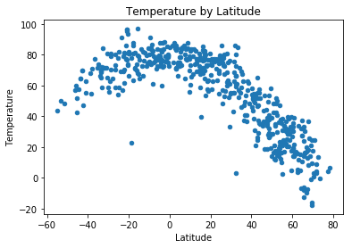
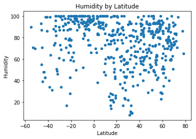
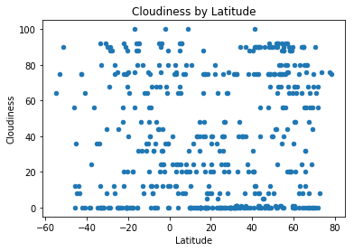
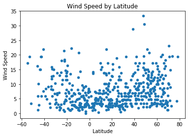

```python
#The plan
#Ok, there's two basic parts of this question. 1- Select 500 cities, 2- cycle through and grab temperature (and step 3, plot)
# It's part 1 that I'm worried about. Are we... selecting random Lat/Longs then finding a nearby city?
# that seems bad- we'll just be favoring coastal cities. I've got a different plan, outlined below, that should be more fair.

#Note long is -180 to 180, lat is -90 to 90
```


```python
#import our libraries- I'm think random, citypy, and whatever lets us grab the weather api. +config, obvi.
import openweathermapy.core as owm
import pandas as pd
import random
import matplotlib as plt
import urllib
from citipy import citipy
#from config import api_weather - ok, so, normally this would be great. But, for github, let's allow user to input
api_weather = input("Please enter your Open Weather Map API Key: ")

#establish the weather settings, let's use Farenheit
settings = {"units": "imperial", "appid": api_weather}
```

    Please enter your Open Weather Map API Key: REDACTED
    


```python
#In order to avoid enormous Pacific sinkholes of data, I'd like to limit our findings further to cities within 200 miles of coords.
#Let's do this:
    #counter =0
    #latitude_list=[]
    #temp_list=[]
    #whole counter = <500
        #Randomly generate coords
        #Find a nearby city with citypy
        #If city is within 200 miles:   <-----------
            #Try to send city to temp API
                #Exceptions for if the city can't be found
            #record lattitude
            #record temp
            #counter=counter+1
            
```


```python
counter = 0
attempts = 0
city_list = []
temp_list = []
humidity_list = []
cloudiness_list = []
windspeed_list = []
lat_list = []
lon_list = []

while counter < 500:
    attempts = attempts + 1
    lat = random.uniform(-90,90)
    lon = random.uniform(-180,180)
    city = citipy.nearest_city(lat,lon)
    if city.city_name in city_list:
        print("{}: {} is already in our list!".format(attempts, city.city_name))
    else:
        try:
            new_weather = owm.get_current(city.city_name + "," + city.country_code, **settings)
        except urllib.error.HTTPError:
            print("{}: {} not found in OWM.".format(attempts, city.city_name)) 
            continue
        if (abs(new_weather['coord']['lon'] - lon) <10 and  #lines of longitude vary a lot. at +/-60, a degree is about ~34 miles. 34*6= 204 miles
        abs(new_weather['coord']['lat'] - lat) <4): #lines of lattitude are pretty constant- 3 degrees will be ~68*3 - 204 miles apart
            city_list.append(city.city_name)
            temp_list.append(new_weather['main']['temp'])
            humidity_list.append(new_weather['main']['humidity'])
            cloudiness_list.append(new_weather['clouds']['all'])
            windspeed_list.append(new_weather['wind']['speed'])
            lat_list.append(new_weather['coord']['lat'])
            lon_list.append(new_weather['coord']['lon'])
            counter = counter+1
            print("{}: Adding {} to our list.".format(attempts, city.city_name))
        else:
            print("{}: {} is too far from the generated coordinates.".format(attempts, city.city_name))
weather_dict = {"City":city_list, "Temperature":temp_list, "Latitude": lat_list, "Longitude":lon_list, "Humidity":humidity_list, "Cloudiness":cloudiness_list, "Wind Speed":windspeed_list}
weather_df = pd.DataFrame(weather_dict)
weather_df
print("It took {} calls to retrieve this data.".format(attempts))
        
```

    1: avarua is too far from the generated coordinates.
    2: Adding esperance to our list.
    3: puerto escondido is too far from the generated coordinates.
    4: bredasdorp is too far from the generated coordinates.
    5: Adding lashio to our list.
    6: bluff is too far from the generated coordinates.
    7: lavrentiya is too far from the generated coordinates.
    8: rikitea is too far from the generated coordinates.
    9: ponta do sol is too far from the generated coordinates.
    10: Adding gao to our list.
    11: Adding skerries to our list.
    12: jequie not found in OWM.
    13: punta arenas is too far from the generated coordinates.
    14: maragogi is too far from the generated coordinates.
    15: taolanaro not found in OWM.
    16: tuatapere is too far from the generated coordinates.
    17: butaritari is too far from the generated coordinates.
    18: hithadhoo is too far from the generated coordinates.
    19: yellowknife is too far from the generated coordinates.
    20: albany is too far from the generated coordinates.
    21: busselton is too far from the generated coordinates.
    22: vardo is too far from the generated coordinates.
    23: barentsburg not found in OWM.
    24: Adding nehe to our list.
    25: Adding byron bay to our list.
    26: rikitea is too far from the generated coordinates.
    27: mataura not found in OWM.
    28: Adding conceicao da barra to our list.
    29: Adding ushuaia to our list.
    30: the valley is too far from the generated coordinates.
    31: bredasdorp is too far from the generated coordinates.
    32: Adding sisimiut to our list.
    33: Adding pokhara to our list.
    34: barrow is too far from the generated coordinates.
    35: yellowknife is too far from the generated coordinates.
    36: vestmannaeyjar is too far from the generated coordinates.
    37: talnakh is too far from the generated coordinates.
    38: hilo is too far from the generated coordinates.
    39: nikolskoye is too far from the generated coordinates.
    40: kodiak is too far from the generated coordinates.
    41: Adding tevaitoa to our list.
    42: bambous virieux is too far from the generated coordinates.
    43: Adding port alfred to our list.
    44: port alfred is already in our list!
    45: vostok is too far from the generated coordinates.
    46: vaini is too far from the generated coordinates.
    47: Adding wanaka to our list.
    48: arraial do cabo is too far from the generated coordinates.
    49: goderich not found in OWM.
    50: ushuaia is already in our list!
    51: nishihara is too far from the generated coordinates.
    52: takoradi is too far from the generated coordinates.
    53: Adding auray to our list.
    54: mataura not found in OWM.
    55: Adding xianyang to our list.
    56: hermanus is too far from the generated coordinates.
    57: yar-sale is too far from the generated coordinates.
    58: hilo is too far from the generated coordinates.
    59: tiksi is too far from the generated coordinates.
    60: narsaq is too far from the generated coordinates.
    61: vaini is too far from the generated coordinates.
    62: albany is too far from the generated coordinates.
    63: mar del plata is too far from the generated coordinates.
    64: amderma not found in OWM.
    65: Adding carnarvon to our list.
    66: castro is too far from the generated coordinates.
    67: ushuaia is already in our list!
    68: Adding san pedro to our list.
    69: leningradskiy is too far from the generated coordinates.
    70: provideniya is too far from the generated coordinates.
    71: Adding kita to our list.
    72: jamestown is too far from the generated coordinates.
    73: Adding shieli to our list.
    74: marcona not found in OWM.
    75: thompson is too far from the generated coordinates.
    76: Adding mirganj to our list.
    77: flinders is too far from the generated coordinates.
    78: bathsheba is too far from the generated coordinates.
    79: mahebourg is too far from the generated coordinates.
    80: sentyabrskiy not found in OWM.
    81: lata not found in OWM.
    82: lavrentiya is too far from the generated coordinates.
    83: Adding araguaina to our list.
    84: samarai is too far from the generated coordinates.
    85: alofi is too far from the generated coordinates.
    86: Adding lamu to our list.
    87: faya not found in OWM.
    88: provideniya is too far from the generated coordinates.
    89: atuona is too far from the generated coordinates.
    90: Adding dalianwan to our list.
    91: temaraia not found in OWM.
    92: Adding reo to our list.
    93: kapaa is too far from the generated coordinates.
    94: saint-philippe is too far from the generated coordinates.
    95: qaanaaq is too far from the generated coordinates.
    96: albany is too far from the generated coordinates.
    97: Adding manggar to our list.
    98: ziyamet not found in OWM.
    99: bluff is too far from the generated coordinates.
    100: san jose is too far from the generated coordinates.
    101: attawapiskat not found in OWM.
    102: beloha is too far from the generated coordinates.
    103: albany is too far from the generated coordinates.
    104: Adding farsund to our list.
    105: Adding taoudenni to our list.
    106: Adding avarua to our list.
    107: tuktoyaktuk is too far from the generated coordinates.
    108: qaanaaq is too far from the generated coordinates.
    109: upernavik is too far from the generated coordinates.
    110: rikitea is too far from the generated coordinates.
    111: severo-kurilsk is too far from the generated coordinates.
    112: hobart is too far from the generated coordinates.
    113: labuhan is too far from the generated coordinates.
    114: Adding mitsamiouli to our list.
    115: bredasdorp is too far from the generated coordinates.
    116: punta arenas is too far from the generated coordinates.
    117: hermanus is too far from the generated coordinates.
    118: Adding nuuk to our list.
    119: vaini is too far from the generated coordinates.
    120: castro is too far from the generated coordinates.
    121: Adding locri to our list.
    122: sentyabrskiy not found in OWM.
    123: vaini is too far from the generated coordinates.
    124: albany is too far from the generated coordinates.
    125: alcantara not found in OWM.
    126: burica not found in OWM.
    127: grand river south east not found in OWM.
    128: Adding southbridge to our list.
    129: salalah is too far from the generated coordinates.
    130: Adding hami to our list.
    131: mataura not found in OWM.
    132: vaini is too far from the generated coordinates.
    133: illoqqortoormiut not found in OWM.
    134: hilo is too far from the generated coordinates.
    135: ushuaia is already in our list!
    136: Adding praxedis guerrero to our list.
    137: faanui is too far from the generated coordinates.
    138: washington is too far from the generated coordinates.
    139: Adding chodavaram to our list.
    140: ushuaia is already in our list!
    141: aflu not found in OWM.
    142: Adding mount isa to our list.
    143: ushuaia is already in our list!
    144: Adding kirakira to our list.
    145: japura not found in OWM.
    146: bengkulu not found in OWM.
    147: Adding lomovka to our list.
    148: taolanaro not found in OWM.
    149: Adding coihaique to our list.
    150: Adding butaritari to our list.
    151: yellowknife is too far from the generated coordinates.
    152: mys shmidta not found in OWM.
    153: vila velha is too far from the generated coordinates.
    154: hermanus is too far from the generated coordinates.
    155: bluff is too far from the generated coordinates.
    156: ushuaia is already in our list!
    157: port elizabeth is too far from the generated coordinates.
    158: denpasar is too far from the generated coordinates.
    159: Adding upernavik to our list.
    160: taolanaro not found in OWM.
    161: rikitea is too far from the generated coordinates.
    162: kavieng is too far from the generated coordinates.
    163: kapaa is too far from the generated coordinates.
    164: albany is too far from the generated coordinates.
    165: atuona is too far from the generated coordinates.
    166: kapaa is too far from the generated coordinates.
    167: hilo is too far from the generated coordinates.
    168: zig not found in OWM.
    169: cabo san lucas is too far from the generated coordinates.
    170: Adding sidmouth to our list.
    171: hermanus is too far from the generated coordinates.
    172: punta arenas is too far from the generated coordinates.
    173: Adding grand-santi to our list.
    174: ponta do sol is too far from the generated coordinates.
    175: bluff is too far from the generated coordinates.
    176: rikitea is too far from the generated coordinates.
    177: Adding oistins to our list.
    178: plettenberg bay is too far from the generated coordinates.
    179: chokurdakh is too far from the generated coordinates.
    180: Adding gorom-gorom to our list.
    181: komsomolskiy is too far from the generated coordinates.
    182: busselton is too far from the generated coordinates.
    183: jamestown is too far from the generated coordinates.
    184: faanui is too far from the generated coordinates.
    185: Adding celestun to our list.
    186: mataura not found in OWM.
    187: Adding yellowknife to our list.
    188: monroe is too far from the generated coordinates.
    189: Adding parati to our list.
    190: carnarvon is already in our list!
    191: Adding bilma to our list.
    192: Adding goundam to our list.
    193: Adding east london to our list.
    194: hilo is too far from the generated coordinates.
    195: avarua is already in our list!
    196: Adding bontang to our list.
    197: Adding brae to our list.
    198: Adding susangerd to our list.
    199: taolanaro not found in OWM.
    200: ushuaia is already in our list!
    201: barentsburg not found in OWM.
    202: vaini is too far from the generated coordinates.
    203: jamestown is too far from the generated coordinates.
    204: illoqqortoormiut not found in OWM.
    205: ust-kamchatsk not found in OWM.
    206: mataura not found in OWM.
    207: bredasdorp is too far from the generated coordinates.
    208: faanui is too far from the generated coordinates.
    209: atuona is too far from the generated coordinates.
    210: tsihombe not found in OWM.
    211: albany is too far from the generated coordinates.
    212: Adding jamestown to our list.
    213: port alfred is already in our list!
    214: saskylakh is too far from the generated coordinates.
    215: rikitea is too far from the generated coordinates.
    216: cidreira is too far from the generated coordinates.
    217: atuona is too far from the generated coordinates.
    218: Adding bandarbeyla to our list.
    219: qaanaaq is too far from the generated coordinates.
    220: Adding benalla to our list.
    221: Adding marawi to our list.
    222: Adding north bend to our list.
    223: Adding cabedelo to our list.
    224: saleaula not found in OWM.
    225: hobart is too far from the generated coordinates.
    226: Adding havoysund to our list.
    227: Adding hit to our list.
    228: hilo is too far from the generated coordinates.
    229: albany is too far from the generated coordinates.
    230: qaanaaq is too far from the generated coordinates.
    231: tasiilaq is too far from the generated coordinates.
    232: mar del plata is too far from the generated coordinates.
    233: Adding salalah to our list.
    234: busselton is too far from the generated coordinates.
    235: port elizabeth is too far from the generated coordinates.
    236: busselton is too far from the generated coordinates.
    237: mataura not found in OWM.
    238: Adding georgetown to our list.
    239: norman wells is too far from the generated coordinates.
    240: vaini is too far from the generated coordinates.
    241: saint-joseph is too far from the generated coordinates.
    242: Adding mingyue to our list.
    243: ponta delgada is too far from the generated coordinates.
    244: belushya guba not found in OWM.
    245: mataura not found in OWM.
    246: hermanus is too far from the generated coordinates.
    247: puerto ayora is too far from the generated coordinates.
    248: faya not found in OWM.
    249: Adding qaqortoq to our list.
    250: vila velha is too far from the generated coordinates.
    251: jalu is too far from the generated coordinates.
    252: kodiak is too far from the generated coordinates.
    253: taolanaro not found in OWM.
    254: Adding dudinka to our list.
    255: Adding caravelas to our list.
    256: esperance is already in our list!
    257: Adding tefe to our list.
    258: port elizabeth is too far from the generated coordinates.
    259: bluff is too far from the generated coordinates.
    260: portland is too far from the generated coordinates.
    261: Adding karratha to our list.
    262: Adding taltal to our list.
    263: port alfred is already in our list!
    264: Adding challapata to our list.
    265: bredasdorp is too far from the generated coordinates.
    266: butaritari is already in our list!
    267: hermanus is too far from the generated coordinates.
    268: Adding yerbogachen to our list.
    269: busselton is too far from the generated coordinates.
    270: port shepstone is too far from the generated coordinates.
    271: jalu is too far from the generated coordinates.
    272: butaritari is already in our list!
    273: taolanaro not found in OWM.
    274: Adding touros to our list.
    275: avarua is already in our list!
    276: taolanaro not found in OWM.
    277: taolanaro not found in OWM.
    278: cabo san lucas is too far from the generated coordinates.
    279: Adding fortuna to our list.
    280: belushya guba not found in OWM.
    281: lebu is too far from the generated coordinates.
    282: hami is already in our list!
    283: taolanaro not found in OWM.
    284: Adding terrace to our list.
    285: Adding kudat to our list.
    286: aklavik is too far from the generated coordinates.
    287: rungata not found in OWM.
    288: kuche not found in OWM.
    289: punta arenas is too far from the generated coordinates.
    290: Adding pangody to our list.
    291: ahipara is too far from the generated coordinates.
    292: Adding purpe to our list.
    293: atuona is too far from the generated coordinates.
    294: Adding shellbrook to our list.
    295: saint-philippe is too far from the generated coordinates.
    296: Adding estacion coahuila to our list.
    297: hermanus is too far from the generated coordinates.
    298: kodiak is too far from the generated coordinates.
    299: Adding saint george to our list.
    300: barrow is too far from the generated coordinates.
    301: guerrero negro is too far from the generated coordinates.
    302: Adding hamilton to our list.
    303: Adding scarborough to our list.
    304: airai not found in OWM.
    305: Adding adrar to our list.
    306: vestmanna is too far from the generated coordinates.
    307: rio grande is too far from the generated coordinates.
    308: Adding ardakan to our list.
    309: mentok not found in OWM.
    310: puerto ayora is too far from the generated coordinates.
    311: butaritari is already in our list!
    312: Adding punta arenas to our list.
    313: taolanaro not found in OWM.
    314: ushuaia is already in our list!
    315: Adding valandovo to our list.
    316: Adding ust-nera to our list.
    317: Adding kudahuvadhoo to our list.
    318: Adding bilibino to our list.
    319: Adding porto torres to our list.
    320: kapaa is too far from the generated coordinates.
    321: Adding te anau to our list.
    322: mataura not found in OWM.
    323: biak is too far from the generated coordinates.
    324: sorland is too far from the generated coordinates.
    325: Adding kununurra to our list.
    326: saint anthony not found in OWM.
    327: Adding boddam to our list.
    328: kaitangata is too far from the generated coordinates.
    329: Adding hobart to our list.
    330: dikson is too far from the generated coordinates.
    331: nuuk is already in our list!
    332: Adding busselton to our list.
    333: kodiak is too far from the generated coordinates.
    334: bredasdorp is too far from the generated coordinates.
    335: provideniya is too far from the generated coordinates.
    336: Adding bintulu to our list.
    337: Adding sorland to our list.
    338: mataura not found in OWM.
    339: butaritari is already in our list!
    340: Adding vanavara to our list.
    341: taolanaro not found in OWM.
    342: portland is too far from the generated coordinates.
    343: rikitea is too far from the generated coordinates.
    344: cape town is too far from the generated coordinates.
    345: bambous virieux is too far from the generated coordinates.
    346: sao filipe is too far from the generated coordinates.
    347: hilo is too far from the generated coordinates.
    348: saldanha is too far from the generated coordinates.
    349: rikitea is too far from the generated coordinates.
    350: Adding richards bay to our list.
    351: rikitea is too far from the generated coordinates.
    352: vaini is too far from the generated coordinates.
    353: Adding alexandria to our list.
    354: Adding ambilobe to our list.
    355: atuona is too far from the generated coordinates.
    356: port hardy is too far from the generated coordinates.
    357: taolanaro not found in OWM.
    358: Adding dauphin to our list.
    359: busselton is already in our list!
    360: Adding mulege to our list.
    361: buala is too far from the generated coordinates.
    362: Adding kasane to our list.
    363: asau not found in OWM.
    364: port alfred is already in our list!
    365: Adding gazli to our list.
    366: airai not found in OWM.
    367: Adding jurm to our list.
    368: Adding eregli to our list.
    369: taolanaro not found in OWM.
    370: saldanha is too far from the generated coordinates.
    371: hermanus is too far from the generated coordinates.
    372: Adding victoria to our list.
    373: sorland is already in our list!
    374: Adding niquero to our list.
    375: Adding jaumave to our list.
    376: Adding roebourne to our list.
    377: kodiak is too far from the generated coordinates.
    378: padang is too far from the generated coordinates.
    379: Adding college to our list.
    380: taolanaro not found in OWM.
    381: punta arenas is already in our list!
    382: ribeira grande is too far from the generated coordinates.
    383: ushuaia is already in our list!
    384: mahebourg is too far from the generated coordinates.
    385: Adding naze to our list.
    386: mataura not found in OWM.
    387: grand river south east not found in OWM.
    388: hithadhoo is too far from the generated coordinates.
    389: Adding ust-kuyga to our list.
    390: vardo is too far from the generated coordinates.
    391: belushya guba not found in OWM.
    392: Adding fairbanks to our list.
    393: hasaki is too far from the generated coordinates.
    394: attawapiskat not found in OWM.
    395: severo-kurilsk is too far from the generated coordinates.
    396: kodiak is too far from the generated coordinates.
    397: ushuaia is already in our list!
    398: ushuaia is already in our list!
    399: hermanus is too far from the generated coordinates.
    400: doctor pedro p. pena not found in OWM.
    401: Adding karlshamn to our list.
    402: hithadhoo is too far from the generated coordinates.
    403: Adding sao joao do paraiso to our list.
    404: cape town is too far from the generated coordinates.
    405: Adding lodja to our list.
    406: tuktoyaktuk is too far from the generated coordinates.
    407: Adding qandala to our list.
    408: arraial do cabo is too far from the generated coordinates.
    409: chuy is too far from the generated coordinates.
    410: butaritari is already in our list!
    411: axim is too far from the generated coordinates.
    412: ushuaia is already in our list!
    413: busselton is already in our list!
    414: mikhaylovka is too far from the generated coordinates.
    415: nikolskoye is too far from the generated coordinates.
    416: Adding high level to our list.
    417: Adding muros to our list.
    418: Adding kapaa to our list.
    419: souillac is too far from the generated coordinates.
    420: vaitupu not found in OWM.
    421: higuey not found in OWM.
    422: busselton is already in our list!
    423: saint-philippe is too far from the generated coordinates.
    424: Adding loma bonita to our list.
    425: vaini is too far from the generated coordinates.
    426: tuktoyaktuk is too far from the generated coordinates.
    427: karratha is already in our list!
    428: ilulissat is too far from the generated coordinates.
    429: atuona is too far from the generated coordinates.
    430: bluff is too far from the generated coordinates.
    431: Adding coari to our list.
    432: rikitea is too far from the generated coordinates.
    433: punta arenas is already in our list!
    434: Adding saint-junien to our list.
    435: burica not found in OWM.
    436: punta arenas is already in our list!
    437: maldonado is too far from the generated coordinates.
    438: busselton is already in our list!
    439: belushya guba not found in OWM.
    440: Adding luxor to our list.
    441: Adding tezu to our list.
    442: port alfred is already in our list!
    443: atuona is too far from the generated coordinates.
    444: tuktoyaktuk is too far from the generated coordinates.
    445: Adding balikpapan to our list.
    446: halalo not found in OWM.
    447: rikitea is too far from the generated coordinates.
    448: thompson is too far from the generated coordinates.
    449: Adding orocue to our list.
    450: rikitea is too far from the generated coordinates.
    451: butaritari is already in our list!
    452: Adding ambon to our list.
    453: barrow is too far from the generated coordinates.
    454: coahuayana is too far from the generated coordinates.
    455: Adding bonavista to our list.
    456: kodiak is too far from the generated coordinates.
    457: Adding las cruces to our list.
    458: gat not found in OWM.
    459: kemijarvi not found in OWM.
    460: rikitea is too far from the generated coordinates.
    461: Adding tomigusuku to our list.
    462: kaitangata is too far from the generated coordinates.
    463: Adding fort nelson to our list.
    464: nikolskoye is too far from the generated coordinates.
    465: Adding vao to our list.
    466: Adding ribeira grande to our list.
    467: marcona not found in OWM.
    468: Adding zalantun to our list.
    469: kapaa is already in our list!
    470: Adding puerto ayora to our list.
    471: butaritari is already in our list!
    472: opobo not found in OWM.
    473: Adding jacareacanga to our list.
    474: bonthe is too far from the generated coordinates.
    475: pevek is too far from the generated coordinates.
    476: cidreira is too far from the generated coordinates.
    477: Adding roma to our list.
    478: vaini is too far from the generated coordinates.
    479: jamestown is already in our list!
    480: avarua is already in our list!
    481: Adding kavaratti to our list.
    482: Adding sao filipe to our list.
    483: Adding ilek to our list.
    484: saleaula not found in OWM.
    485: Adding eyl to our list.
    486: butaritari is already in our list!
    487: punta arenas is already in our list!
    488: busselton is already in our list!
    489: illoqqortoormiut not found in OWM.
    490: tuktoyaktuk is too far from the generated coordinates.
    491: taolanaro not found in OWM.
    492: bethel is too far from the generated coordinates.
    493: hermanus is too far from the generated coordinates.
    494: illoqqortoormiut not found in OWM.
    495: Adding barraute to our list.
    496: kodiak is too far from the generated coordinates.
    497: rikitea is too far from the generated coordinates.
    498: petropavlovsk-kamchatskiy is too far from the generated coordinates.
    499: cidreira is too far from the generated coordinates.
    500: Adding lethem to our list.
    501: Adding munchberg to our list.
    502: provideniya is too far from the generated coordinates.
    503: bengkulu not found in OWM.
    504: mys shmidta not found in OWM.
    505: Adding gazojak to our list.
    506: taolanaro not found in OWM.
    507: jamestown is already in our list!
    508: marzuq not found in OWM.
    509: makakilo city is too far from the generated coordinates.
    510: ponta do sol is too far from the generated coordinates.
    511: xinpu is too far from the generated coordinates.
    512: Adding pavilosta to our list.
    513: khatanga is too far from the generated coordinates.
    514: cidreira is too far from the generated coordinates.
    515: Adding pinerovka to our list.
    516: hambantota is too far from the generated coordinates.
    517: butaritari is already in our list!
    518: jamestown is already in our list!
    519: rocha is too far from the generated coordinates.
    520: vardo is too far from the generated coordinates.
    521: port elizabeth is too far from the generated coordinates.
    522: Adding kyrylivka to our list.
    523: Adding magistralnyy to our list.
    524: bud is too far from the generated coordinates.
    525: grand gaube is too far from the generated coordinates.
    526: kaitangata is too far from the generated coordinates.
    527: Adding sal rei to our list.
    528: hobart is already in our list!
    529: hobart is already in our list!
    530: hithadhoo is too far from the generated coordinates.
    531: Adding fomboni to our list.
    532: bathsheba is too far from the generated coordinates.
    533: Adding leticia to our list.
    534: Adding vega de alatorre to our list.
    535: milkovo not found in OWM.
    536: hithadhoo is too far from the generated coordinates.
    537: ushuaia is already in our list!
    538: vila velha is too far from the generated coordinates.
    539: punta arenas is already in our list!
    540: illoqqortoormiut not found in OWM.
    541: saldanha is too far from the generated coordinates.
    542: Adding nadym to our list.
    543: Adding chuy to our list.
    544: bambous virieux is too far from the generated coordinates.
    545: Adding awbari to our list.
    546: illoqqortoormiut not found in OWM.
    547: Adding pemba to our list.
    548: Adding yakeshi to our list.
    549: port alfred is already in our list!
    550: coquimbo is too far from the generated coordinates.
    551: Adding namibe to our list.
    552: Adding kutno to our list.
    553: kruisfontein is too far from the generated coordinates.
    554: yellowknife is already in our list!
    555: illoqqortoormiut not found in OWM.
    556: Adding greytown to our list.
    557: lazaro cardenas is too far from the generated coordinates.
    558: hermanus is too far from the generated coordinates.
    559: ribeira grande is already in our list!
    560: nanortalik is too far from the generated coordinates.
    561: vao is already in our list!
    562: tuktoyaktuk is too far from the generated coordinates.
    563: katsuura is too far from the generated coordinates.
    564: kamenskoye not found in OWM.
    565: Adding talara to our list.
    566: jamestown is already in our list!
    567: Adding stepnogorsk to our list.
    568: leningradskiy is too far from the generated coordinates.
    569: Adding tasiilaq to our list.
    570: Adding deputatskiy to our list.
    571: rikitea is too far from the generated coordinates.
    572: thompson is too far from the generated coordinates.
    573: port elizabeth is too far from the generated coordinates.
    574: khatanga is too far from the generated coordinates.
    575: busselton is already in our list!
    576: vaini is too far from the generated coordinates.
    577: hermanus is too far from the generated coordinates.
    578: rikitea is too far from the generated coordinates.
    579: bandarbeyla is already in our list!
    580: mar del plata is too far from the generated coordinates.
    581: yellowknife is already in our list!
    582: Adding loviisa to our list.
    583: mataura not found in OWM.
    584: butaritari is already in our list!
    585: vestmannaeyjar is too far from the generated coordinates.
    586: Adding port shepstone to our list.
    587: Adding tahe to our list.
    588: barrow is too far from the generated coordinates.
    589: ambon is already in our list!
    590: ushuaia is already in our list!
    591: Adding corner brook to our list.
    592: mataura not found in OWM.
    593: hithadhoo is too far from the generated coordinates.
    594: lasa not found in OWM.
    595: hobart is already in our list!
    596: Adding road town to our list.
    597: rikitea is too far from the generated coordinates.
    598: touros is already in our list!
    599: mataura not found in OWM.
    600: Adding cockburn town to our list.
    601: bluff is too far from the generated coordinates.
    602: thompson is too far from the generated coordinates.
    603: Adding saldanha to our list.
    604: saint anthony not found in OWM.
    605: busselton is already in our list!
    606: ushuaia is already in our list!
    607: hilo is too far from the generated coordinates.
    608: flinders is too far from the generated coordinates.
    609: cabo san lucas is too far from the generated coordinates.
    610: port alfred is already in our list!
    611: albany is too far from the generated coordinates.
    612: tiksi is too far from the generated coordinates.
    613: bredasdorp is too far from the generated coordinates.
    614: Adding eureka to our list.
    615: Adding portobelo to our list.
    616: longyearbyen is too far from the generated coordinates.
    617: Adding singaraja to our list.
    618: taolanaro not found in OWM.
    619: Adding baykit to our list.
    620: ushuaia is already in our list!
    621: ushuaia is already in our list!
    622: rikitea is too far from the generated coordinates.
    623: Adding longyearbyen to our list.
    624: lebu is too far from the generated coordinates.
    625: ushuaia is already in our list!
    626: Adding jaragua do sul to our list.
    627: bambous virieux is too far from the generated coordinates.
    628: Adding uyskoye to our list.
    629: puerto ayora is already in our list!
    630: Adding alice springs to our list.
    631: rikitea is too far from the generated coordinates.
    632: ushuaia is already in our list!
    633: santa eulalia del rio not found in OWM.
    634: ushuaia is already in our list!
    635: ushuaia is already in our list!
    636: Adding biltine to our list.
    637: cape town is too far from the generated coordinates.
    638: chapais is too far from the generated coordinates.
    639: katsuura is too far from the generated coordinates.
    640: ushuaia is already in our list!
    641: Adding terra rica to our list.
    642: san patricio is too far from the generated coordinates.
    643: Adding cartagena to our list.
    644: Adding ozinki to our list.
    645: busselton is already in our list!
    646: jamestown is already in our list!
    647: Adding aykhal to our list.
    648: Adding kandiari to our list.
    649: airai not found in OWM.
    650: busselton is already in our list!
    651: vaini is too far from the generated coordinates.
    652: carnarvon is already in our list!
    653: illoqqortoormiut not found in OWM.
    654: Adding macduff to our list.
    655: hobart is already in our list!
    656: Adding chara to our list.
    657: Adding pundaguitan to our list.
    658: Adding norrtalje to our list.
    659: jamestown is already in our list!
    660: Adding port-gentil to our list.
    661: kapaa is already in our list!
    662: barentsburg not found in OWM.
    663: komsomolskiy is too far from the generated coordinates.
    664: Adding san ignacio to our list.
    665: bredasdorp is too far from the generated coordinates.
    666: mataura not found in OWM.
    667: Adding hay river to our list.
    668: yellowknife is already in our list!
    669: Adding port-cartier to our list.
    670: barrow is too far from the generated coordinates.
    671: karamay not found in OWM.
    672: carutapera is too far from the generated coordinates.
    673: pevek is too far from the generated coordinates.
    674: sabang is too far from the generated coordinates.
    675: kodiak is too far from the generated coordinates.
    676: severo-kurilsk is too far from the generated coordinates.
    677: Adding kungurtug to our list.
    678: tatsinskaya not found in OWM.
    679: lagoa is too far from the generated coordinates.
    680: Adding ulaanbaatar to our list.
    681: kuche not found in OWM.
    682: Adding almeirim to our list.
    683: mudyuga not found in OWM.
    684: cape town is too far from the generated coordinates.
    685: arraial do cabo is too far from the generated coordinates.
    686: illoqqortoormiut not found in OWM.
    687: atuona is too far from the generated coordinates.
    688: hithadhoo is too far from the generated coordinates.
    689: punta arenas is already in our list!
    690: kapaa is already in our list!
    691: illoqqortoormiut not found in OWM.
    692: bengkulu not found in OWM.
    693: Adding khatanga to our list.
    694: Adding seymchan to our list.
    695: hilo is too far from the generated coordinates.
    696: ushuaia is already in our list!
    697: busselton is already in our list!
    698: Adding viedma to our list.
    699: Adding marsh harbour to our list.
    700: new norfolk is too far from the generated coordinates.
    701: albany is too far from the generated coordinates.
    702: Adding kushima to our list.
    703: albany is too far from the generated coordinates.
    704: vostok is too far from the generated coordinates.
    705: rikitea is too far from the generated coordinates.
    706: taolanaro not found in OWM.
    707: dikson is too far from the generated coordinates.
    708: Adding henties bay to our list.
    709: Adding panino to our list.
    710: hobart is already in our list!
    711: smithers is too far from the generated coordinates.
    712: jamestown is already in our list!
    713: Adding masumbwe to our list.
    714: henties bay is already in our list!
    715: taolanaro not found in OWM.
    716: Adding la cruz to our list.
    717: puerto ayora is already in our list!
    718: rikitea is too far from the generated coordinates.
    719: Adding sabya to our list.
    720: taolanaro not found in OWM.
    721: dunedin is too far from the generated coordinates.
    722: palabuhanratu not found in OWM.
    723: klaksvik is too far from the generated coordinates.
    724: Adding yumaguzino to our list.
    725: Adding kudligi to our list.
    726: arraial do cabo is too far from the generated coordinates.
    727: Adding mandera to our list.
    728: ribeira grande is already in our list!
    729: Adding chapleau to our list.
    730: busselton is already in our list!
    731: ushuaia is already in our list!
    732: nanortalik is too far from the generated coordinates.
    733: Adding port lincoln to our list.
    734: Adding anadyr to our list.
    735: Adding terrak to our list.
    736: kaitangata is too far from the generated coordinates.
    737: rikitea is too far from the generated coordinates.
    738: yellowknife is already in our list!
    739: konevo is too far from the generated coordinates.
    740: kungurtug is already in our list!
    741: Adding noumea to our list.
    742: Adding tilichiki to our list.
    743: qaanaaq is too far from the generated coordinates.
    744: ushuaia is already in our list!
    745: Adding weligama to our list.
    746: ushuaia is already in our list!
    747: Adding burnie to our list.
    748: Adding lillooet to our list.
    749: Adding atar to our list.
    750: Adding shepsi to our list.
    751: mataura not found in OWM.
    752: maymanak not found in OWM.
    753: kodiak is too far from the generated coordinates.
    754: Adding qingdao to our list.
    755: mys shmidta not found in OWM.
    756: isangel is too far from the generated coordinates.
    757: port alfred is already in our list!
    758: esperance is already in our list!
    759: khatanga is already in our list!
    760: Adding pangnirtung to our list.
    761: ribeira grande is already in our list!
    762: Adding sussex to our list.
    763: rikitea is too far from the generated coordinates.
    764: urfa not found in OWM.
    765: grand gaube is too far from the generated coordinates.
    766: palmer is too far from the generated coordinates.
    767: jamestown is already in our list!
    768: ushuaia is already in our list!
    769: bluff is too far from the generated coordinates.
    770: rikitea is too far from the generated coordinates.
    771: Adding tiznit to our list.
    772: saint-philippe is too far from the generated coordinates.
    773: thompson is too far from the generated coordinates.
    774: Adding pau brasil to our list.
    775: te anau is already in our list!
    776: butaritari is already in our list!
    777: vaini is too far from the generated coordinates.
    778: hermanus is too far from the generated coordinates.
    779: Adding atambua to our list.
    780: mys shmidta not found in OWM.
    781: qaanaaq is too far from the generated coordinates.
    782: Adding impfondo to our list.
    783: isangel is too far from the generated coordinates.
    784: jamestown is already in our list!
    785: new norfolk is too far from the generated coordinates.
    786: Adding juneau to our list.
    787: komsomolskiy is too far from the generated coordinates.
    788: kapaa is already in our list!
    789: praia da vitoria is too far from the generated coordinates.
    790: Adding ilulissat to our list.
    791: bluff is too far from the generated coordinates.
    792: punta arenas is already in our list!
    793: mar del plata is too far from the generated coordinates.
    794: east london is already in our list!
    795: torbay is too far from the generated coordinates.
    796: Adding kieta to our list.
    797: sandwick is too far from the generated coordinates.
    798: lebu is too far from the generated coordinates.
    799: mar del plata is too far from the generated coordinates.
    800: umzimvubu not found in OWM.
    801: avarua is already in our list!
    802: ushuaia is already in our list!
    803: busselton is already in our list!
    804: awbari is already in our list!
    805: arroyo is too far from the generated coordinates.
    806: adrar is already in our list!
    807: Adding saskylakh to our list.
    808: puerto ayora is already in our list!
    809: lebu is too far from the generated coordinates.
    810: ushuaia is already in our list!
    811: yellowknife is already in our list!
    812: busselton is already in our list!
    813: Adding soure to our list.
    814: Adding ayorou to our list.
    815: rikitea is too far from the generated coordinates.
    816: Adding cayenne to our list.
    817: Adding madimba to our list.
    818: lebu is too far from the generated coordinates.
    819: punta arenas is already in our list!
    820: taolanaro not found in OWM.
    821: port-gentil is already in our list!
    822: Adding nelson bay to our list.
    823: Adding calabozo to our list.
    824: ushuaia is already in our list!
    825: kapaa is already in our list!
    826: taolanaro not found in OWM.
    827: Adding outram to our list.
    828: Adding port moresby to our list.
    829: ushuaia is already in our list!
    830: hermanus is too far from the generated coordinates.
    831: bengkulu not found in OWM.
    832: cherskiy is too far from the generated coordinates.
    833: rikitea is too far from the generated coordinates.
    834: albany is too far from the generated coordinates.
    835: Adding torbay to our list.
    836: Adding teya to our list.
    837: albany is too far from the generated coordinates.
    838: cherskiy is too far from the generated coordinates.
    839: new norfolk is too far from the generated coordinates.
    840: Adding hobyo to our list.
    841: Adding hilo to our list.
    842: Adding marsa matruh to our list.
    843: new norfolk is too far from the generated coordinates.
    844: Adding ugoofaaru to our list.
    845: nikolskoye is too far from the generated coordinates.
    846: ushuaia is already in our list!
    847: do rud not found in OWM.
    848: Adding rimouski to our list.
    849: Adding moranbah to our list.
    850: barrow is too far from the generated coordinates.
    851: kaitangata is too far from the generated coordinates.
    852: albany is too far from the generated coordinates.
    853: belushya guba not found in OWM.
    854: Adding ofaqim to our list.
    855: vaini is too far from the generated coordinates.
    856: bluff is too far from the generated coordinates.
    857: norman wells is too far from the generated coordinates.
    858: Adding maceio to our list.
    859: mar del plata is too far from the generated coordinates.
    860: ahuimanu is too far from the generated coordinates.
    861: Adding tigil to our list.
    862: Adding ledec to our list.
    863: Adding agadez to our list.
    864: Adding bireun to our list.
    865: vaitupu not found in OWM.
    866: chokurdakh is too far from the generated coordinates.
    867: atuona is too far from the generated coordinates.
    868: Adding puerto madero to our list.
    869: mataura not found in OWM.
    870: saldanha is already in our list!
    871: lebu is too far from the generated coordinates.
    872: kapaa is already in our list!
    873: punta arenas is already in our list!
    874: Adding pasni to our list.
    875: rikitea is too far from the generated coordinates.
    876: cape town is too far from the generated coordinates.
    877: illoqqortoormiut not found in OWM.
    878: Adding tanout to our list.
    879: Adding padang to our list.
    880: Adding arlit to our list.
    881: henties bay is already in our list!
    882: olafsvik not found in OWM.
    883: khatanga is already in our list!
    884: Adding tshikapa to our list.
    885: Adding cherskiy to our list.
    886: Adding andra to our list.
    887: Adding springbok to our list.
    888: kapaa is already in our list!
    889: harper is too far from the generated coordinates.
    890: Adding almaty to our list.
    891: tiksi is too far from the generated coordinates.
    892: jamestown is already in our list!
    893: Adding san rafael to our list.
    894: hithadhoo is too far from the generated coordinates.
    895: Adding tual to our list.
    896: Adding tautira to our list.
    897: georgetown is already in our list!
    898: bredasdorp is too far from the generated coordinates.
    899: bredasdorp is too far from the generated coordinates.
    900: chuy is already in our list!
    901: Adding aswan to our list.
    902: beloha is too far from the generated coordinates.
    903: Adding trinidad to our list.
    904: hermanus is too far from the generated coordinates.
    905: port alfred is already in our list!
    906: hobart is already in our list!
    907: punta arenas is already in our list!
    908: kavieng is too far from the generated coordinates.
    909: arraial do cabo is too far from the generated coordinates.
    910: ushuaia is already in our list!
    911: hasaki is too far from the generated coordinates.
    912: bathsheba is too far from the generated coordinates.
    913: rikitea is too far from the generated coordinates.
    914: albany is too far from the generated coordinates.
    915: hilo is already in our list!
    916: Adding port blair to our list.
    917: sao joao da barra is too far from the generated coordinates.
    918: sumen not found in OWM.
    919: Adding malyye derbety to our list.
    920: kapaa is already in our list!
    921: Adding guerande to our list.
    922: butaritari is already in our list!
    923: atuona is too far from the generated coordinates.
    924: targu bujor not found in OWM.
    925: kaitangata is too far from the generated coordinates.
    926: Adding sibu to our list.
    927: barentsburg not found in OWM.
    928: Adding la ronge to our list.
    929: Adding murray bridge to our list.
    930: kodiak is too far from the generated coordinates.
    931: Adding llanes to our list.
    932: Adding vila do maio to our list.
    933: mahebourg is too far from the generated coordinates.
    934: new norfolk is too far from the generated coordinates.
    935: Adding nongpoh to our list.
    936: pangnirtung is already in our list!
    937: Adding homer to our list.
    938: rikitea is too far from the generated coordinates.
    939: ushuaia is already in our list!
    940: hobart is already in our list!
    941: Adding presidencia roque saenz pena to our list.
    942: Adding tyler to our list.
    943: Adding si bun ruang to our list.
    944: Adding itoman to our list.
    945: sao filipe is already in our list!
    946: coihaique is already in our list!
    947: pevek is too far from the generated coordinates.
    948: ushuaia is already in our list!
    949: Adding vitim to our list.
    950: kruisfontein is too far from the generated coordinates.
    951: cabo san lucas is too far from the generated coordinates.
    952: mount gambier is too far from the generated coordinates.
    953: Adding tondano to our list.
    954: Adding charters towers to our list.
    955: jamestown is already in our list!
    956: Adding saint-pierre to our list.
    957: mar del plata is too far from the generated coordinates.
    958: Adding jiaohe to our list.
    959: Adding yarmouth to our list.
    960: vanimo is too far from the generated coordinates.
    961: busselton is already in our list!
    962: esperance is already in our list!
    963: port-gentil is already in our list!
    964: Adding nuqui to our list.
    965: carnarvon is already in our list!
    966: bethel is too far from the generated coordinates.
    967: longyearbyen is already in our list!
    968: cape town is too far from the generated coordinates.
    969: sao sebastiao is too far from the generated coordinates.
    970: cayenne is already in our list!
    971: chokurdakh is too far from the generated coordinates.
    972: punta arenas is already in our list!
    973: punta arenas is already in our list!
    974: esperance is already in our list!
    975: pisco is too far from the generated coordinates.
    976: cherskiy is already in our list!
    977: east london is already in our list!
    978: rikitea is too far from the generated coordinates.
    979: Adding batagay-alyta to our list.
    980: katsuura is too far from the generated coordinates.
    981: Adding baturaja to our list.
    982: qaanaaq is too far from the generated coordinates.
    983: beringovskiy is too far from the generated coordinates.
    984: mys shmidta not found in OWM.
    985: Adding iqaluit to our list.
    986: Adding kwinana to our list.
    987: Adding turukhansk to our list.
    988: punta arenas is already in our list!
    989: pevek is too far from the generated coordinates.
    990: khatanga is already in our list!
    991: dikson is too far from the generated coordinates.
    992: Adding atbasar to our list.
    993: Adding saint-francois to our list.
    994: Adding eirunepe to our list.
    995: mahebourg is too far from the generated coordinates.
    996: mataura not found in OWM.
    997: Adding leningradskiy to our list.
    998: Adding ossora to our list.
    999: bluff is too far from the generated coordinates.
    1000: platonovka not found in OWM.
    1001: atar is already in our list!
    1002: pevek is too far from the generated coordinates.
    1003: hihifo not found in OWM.
    1004: avarua is already in our list!
    1005: Adding asosa to our list.
    1006: khatanga is already in our list!
    1007: barrow is too far from the generated coordinates.
    1008: Adding kapuskasing to our list.
    1009: dikson is too far from the generated coordinates.
    1010: hilo is already in our list!
    1011: Adding sayyan to our list.
    1012: Adding aripuana to our list.
    1013: port hardy is too far from the generated coordinates.
    1014: ribeira grande is already in our list!
    1015: Adding riverton to our list.
    1016: atuona is too far from the generated coordinates.
    1017: chokurdakh is too far from the generated coordinates.
    1018: safwah not found in OWM.
    1019: Adding koshurnikovo to our list.
    1020: rikitea is too far from the generated coordinates.
    1021: punta arenas is already in our list!
    1022: atuona is too far from the generated coordinates.
    1023: hilo is already in our list!
    1024: Adding los llanos de aridane to our list.
    1025: Adding sabzevar to our list.
    1026: Adding dikson to our list.
    1027: Adding kharan to our list.
    1028: olafsvik not found in OWM.
    1029: rikitea is too far from the generated coordinates.
    1030: Adding yar-sale to our list.
    1031: ushuaia is already in our list!
    1032: bluff is too far from the generated coordinates.
    1033: charters towers is already in our list!
    1034: hermanus is too far from the generated coordinates.
    1035: punta arenas is already in our list!
    1036: hilo is already in our list!
    1037: puerto ayora is already in our list!
    1038: Adding rio gallegos to our list.
    1039: Adding broome to our list.
    1040: ushuaia is already in our list!
    1041: mataura not found in OWM.
    1042: mataura not found in OWM.
    1043: kieta is already in our list!
    1044: Adding shobara to our list.
    1045: Adding casas adobes to our list.
    1046: busselton is already in our list!
    1047: saldanha is already in our list!
    1048: Adding constantine to our list.
    1049: bluff is too far from the generated coordinates.
    1050: kavieng is too far from the generated coordinates.
    1051: Adding daru to our list.
    1052: alice springs is already in our list!
    1053: puerto ayora is already in our list!
    1054: kamenka is too far from the generated coordinates.
    1055: Adding pocatello to our list.
    1056: fairbanks is already in our list!
    1057: punta arenas is already in our list!
    1058: Adding kalmunai to our list.
    1059: rikitea is too far from the generated coordinates.
    1060: belushya guba not found in OWM.
    1061: shimoda is too far from the generated coordinates.
    1062: Adding inta to our list.
    1063: rikitea is too far from the generated coordinates.
    1064: rikitea is too far from the generated coordinates.
    1065: bluff is too far from the generated coordinates.
    1066: Adding fort smith to our list.
    1067: grand river south east not found in OWM.
    1068: taolanaro not found in OWM.
    1069: bluff is too far from the generated coordinates.
    1070: Adding jalu to our list.
    1071: atuona is too far from the generated coordinates.
    1072: jalu is already in our list!
    1073: arlit is already in our list!
    1074: Adding ketchikan to our list.
    1075: rikitea is too far from the generated coordinates.
    1076: maragogi is too far from the generated coordinates.
    1077: bengkulu not found in OWM.
    1078: new norfolk is too far from the generated coordinates.
    1079: sitka is too far from the generated coordinates.
    1080: Adding amga to our list.
    1081: lazaro cardenas is too far from the generated coordinates.
    1082: cape town is too far from the generated coordinates.
    1083: kavieng is too far from the generated coordinates.
    1084: cidreira is too far from the generated coordinates.
    1085: hasaki is too far from the generated coordinates.
    1086: Adding mabaruma to our list.
    1087: sobolevo is too far from the generated coordinates.
    1088: cayenne is already in our list!
    1089: Adding boende to our list.
    1090: cidreira is too far from the generated coordinates.
    1091: hovd is too far from the generated coordinates.
    1092: Adding mount gambier to our list.
    1093: Adding kosino to our list.
    1094: dunedin is too far from the generated coordinates.
    1095: ushuaia is already in our list!
    1096: tsihombe not found in OWM.
    1097: butaritari is already in our list!
    1098: rikitea is too far from the generated coordinates.
    1099: ushuaia is already in our list!
    1100: port elizabeth is too far from the generated coordinates.
    1101: hutchinson is too far from the generated coordinates.
    1102: puerto ayora is already in our list!
    1103: tual is already in our list!
    1104: chokurdakh is too far from the generated coordinates.
    1105: port alfred is already in our list!
    1106: touros is already in our list!
    1107: Adding iberia to our list.
    1108: albany is too far from the generated coordinates.
    1109: rikitea is too far from the generated coordinates.
    1110: Adding yumen to our list.
    1111: ushuaia is already in our list!
    1112: rikitea is too far from the generated coordinates.
    1113: mataura not found in OWM.
    1114: punta arenas is already in our list!
    1115: Adding ilukste to our list.
    1116: samusu not found in OWM.
    1117: taolanaro not found in OWM.
    1118: saint-philippe is too far from the generated coordinates.
    1119: leghorn not found in OWM.
    1120: Adding huanan to our list.
    1121: albany is too far from the generated coordinates.
    1122: cidreira is too far from the generated coordinates.
    1123: boa esperanca is too far from the generated coordinates.
    1124: torbay is already in our list!
    1125: labuhan is too far from the generated coordinates.
    1126: punta arenas is already in our list!
    1127: nikolskoye is too far from the generated coordinates.
    1128: Adding benguela to our list.
    1129: olafsvik not found in OWM.
    1130: hobart is already in our list!
    1131: butaritari is already in our list!
    1132: barrow is too far from the generated coordinates.
    1133: arraial do cabo is too far from the generated coordinates.
    1134: hermanus is too far from the generated coordinates.
    1135: juba not found in OWM.
    1136: albany is too far from the generated coordinates.
    1137: Adding ariquemes to our list.
    1138: Adding ryotsu to our list.
    1139: puerto ayora is already in our list!
    1140: dikson is already in our list!
    1141: cabo san lucas is too far from the generated coordinates.
    1142: mataura not found in OWM.
    1143: lebu is too far from the generated coordinates.
    1144: gurgan not found in OWM.
    1145: bluff is too far from the generated coordinates.
    1146: punta arenas is already in our list!
    1147: new norfolk is too far from the generated coordinates.
    1148: rikitea is too far from the generated coordinates.
    1149: phrai bung not found in OWM.
    1150: Adding bubaque to our list.
    1151: hualmay is too far from the generated coordinates.
    1152: Adding marquette to our list.
    1153: kapaa is already in our list!
    1154: taoudenni is already in our list!
    1155: vaitupu not found in OWM.
    1156: Adding salinopolis to our list.
    1157: taolanaro not found in OWM.
    1158: jamestown is already in our list!
    1159: port-cartier is already in our list!
    1160: ushuaia is already in our list!
    1161: Adding aksu to our list.
    1162: Adding clyde river to our list.
    1163: port alfred is already in our list!
    1164: cape town is too far from the generated coordinates.
    1165: puerto ayora is already in our list!
    1166: albany is too far from the generated coordinates.
    1167: chokurdakh is too far from the generated coordinates.
    1168: lagoa is too far from the generated coordinates.
    1169: Adding tuatapere to our list.
    1170: hobart is already in our list!
    1171: severo-kurilsk is too far from the generated coordinates.
    1172: rikitea is too far from the generated coordinates.
    1173: georgetown is already in our list!
    1174: qaanaaq is too far from the generated coordinates.
    1175: hermanus is too far from the generated coordinates.
    1176: tuktoyaktuk is too far from the generated coordinates.
    1177: hobart is already in our list!
    1178: bolungarvik not found in OWM.
    1179: illoqqortoormiut not found in OWM.
    1180: Adding ust-tsilma to our list.
    1181: tumannyy not found in OWM.
    1182: estacion coahuila is already in our list!
    1183: busselton is already in our list!
    1184: Adding great yarmouth to our list.
    1185: Adding zhigansk to our list.
    1186: Adding pinyug to our list.
    1187: east london is already in our list!
    1188: Adding inirida to our list.
    1189: Adding xuddur to our list.
    1190: Adding caska to our list.
    1191: yellowknife is already in our list!
    1192: Adding lavrentiya to our list.
    1193: Adding bathsheba to our list.
    1194: turtkul not found in OWM.
    1195: east london is already in our list!
    1196: benguela is already in our list!
    1197: kapaa is already in our list!
    1198: Adding sabha to our list.
    1199: sao filipe is already in our list!
    1200: bredasdorp is too far from the generated coordinates.
    1201: vaitupu not found in OWM.
    1202: tuatapere is already in our list!
    1203: puerto ayora is already in our list!
    1204: east london is already in our list!
    1205: mahebourg is too far from the generated coordinates.
    1206: punta arenas is already in our list!
    1207: mataura not found in OWM.
    1208: ushuaia is already in our list!
    1209: Adding ebolowa to our list.
    1210: north bend is already in our list!
    1211: arraial do cabo is too far from the generated coordinates.
    1212: nanortalik is too far from the generated coordinates.
    1213: Adding jumla to our list.
    1214: mataura not found in OWM.
    1215: albany is too far from the generated coordinates.
    1216: ilulissat is already in our list!
    1217: Adding truro to our list.
    1218: punta arenas is already in our list!
    1219: rikitea is too far from the generated coordinates.
    1220: punta arenas is already in our list!
    1221: rabo de peixe is too far from the generated coordinates.
    1222: east london is already in our list!
    1223: Adding tiksi to our list.
    1224: bambous virieux is too far from the generated coordinates.
    1225: Adding batagay to our list.
    1226: hasaki is too far from the generated coordinates.
    1227: jalu is already in our list!
    1228: Adding necochea to our list.
    1229: kamenka is too far from the generated coordinates.
    1230: bluff is too far from the generated coordinates.
    1231: taoudenni is already in our list!
    1232: new norfolk is too far from the generated coordinates.
    1233: Adding kalabo to our list.
    1234: Adding nushki to our list.
    1235: jamestown is already in our list!
    1236: hermanus is too far from the generated coordinates.
    1237: seredka is too far from the generated coordinates.
    1238: katsuura is too far from the generated coordinates.
    1239: tuktoyaktuk is too far from the generated coordinates.
    1240: hobart is already in our list!
    1241: cape town is too far from the generated coordinates.
    1242: Adding les cayes to our list.
    1243: mahebourg is too far from the generated coordinates.
    1244: Adding tete to our list.
    1245: labutta not found in OWM.
    1246: castro is too far from the generated coordinates.
    1247: provideniya is too far from the generated coordinates.
    1248: celestun is already in our list!
    1249: talnakh is too far from the generated coordinates.
    1250: Adding camabatela to our list.
    1251: victoria is already in our list!
    1252: inderborskiy not found in OWM.
    1253: Adding banjarmasin to our list.
    1254: georgetown is already in our list!
    1255: abu jubayhah not found in OWM.
    1256: ushuaia is already in our list!
    1257: Adding karacabey to our list.
    1258: hobart is already in our list!
    1259: harrisburg is too far from the generated coordinates.
    1260: lebu is too far from the generated coordinates.
    1261: bluff is too far from the generated coordinates.
    1262: Adding boras to our list.
    1263: Adding camopi to our list.
    1264: haibowan not found in OWM.
    1265: hilo is already in our list!
    1266: bristol is too far from the generated coordinates.
    1267: asau not found in OWM.
    1268: saint-augustin is too far from the generated coordinates.
    1269: ushuaia is already in our list!
    1270: Adding maloyaroslavets to our list.
    1271: Adding srednekolymsk to our list.
    1272: ushuaia is already in our list!
    1273: Adding birsk to our list.
    1274: Adding hargeysa to our list.
    1275: Adding dharmanagar to our list.
    1276: fortuna is already in our list!
    1277: atuona is too far from the generated coordinates.
    1278: thompson is too far from the generated coordinates.
    1279: mataura not found in OWM.
    1280: tiksi is already in our list!
    1281: lompoc is too far from the generated coordinates.
    1282: ushuaia is already in our list!
    1283: rikitea is too far from the generated coordinates.
    1284: nome is too far from the generated coordinates.
    1285: nizhneyansk not found in OWM.
    1286: rikitea is too far from the generated coordinates.
    1287: amderma not found in OWM.
    1288: barrow is too far from the generated coordinates.
    1289: Adding lerwick to our list.
    1290: new norfolk is too far from the generated coordinates.
    1291: rikitea is too far from the generated coordinates.
    1292: tuktoyaktuk is too far from the generated coordinates.
    1293: rikitea is too far from the generated coordinates.
    1294: hamilton is already in our list!
    1295: busselton is already in our list!
    1296: hithadhoo is too far from the generated coordinates.
    1297: ushuaia is already in our list!
    1298: rikitea is too far from the generated coordinates.
    1299: rikitea is too far from the generated coordinates.
    1300: laguna not found in OWM.
    1301: punta arenas is already in our list!
    1302: himora not found in OWM.
    1303: bethel is too far from the generated coordinates.
    1304: victoria is already in our list!
    1305: ancud is too far from the generated coordinates.
    1306: Adding walvis bay to our list.
    1307: lebu is too far from the generated coordinates.
    1308: vaitupu not found in OWM.
    1309: mataura not found in OWM.
    1310: hilo is already in our list!
    1311: Adding balingasay to our list.
    1312: Adding ajaccio to our list.
    1313: saint george is already in our list!
    1314: Adding najran to our list.
    1315: vardo is too far from the generated coordinates.
    1316: busselton is already in our list!
    1317: Adding iquique to our list.
    1318: rikitea is too far from the generated coordinates.
    1319: atuona is too far from the generated coordinates.
    1320: lorengau is too far from the generated coordinates.
    1321: ushuaia is already in our list!
    1322: rikitea is too far from the generated coordinates.
    1323: Adding nouadhibou to our list.
    1324: Adding mae sai to our list.
    1325: kruisfontein is too far from the generated coordinates.
    1326: vestmannaeyjar is too far from the generated coordinates.
    1327: jamestown is already in our list!
    1328: port alfred is already in our list!
    1329: severo-kurilsk is too far from the generated coordinates.
    1330: new norfolk is too far from the generated coordinates.
    1331: belushya guba not found in OWM.
    1332: pisco is too far from the generated coordinates.
    1333: rikitea is too far from the generated coordinates.
    1334: rikitea is too far from the generated coordinates.
    1335: kodiak is too far from the generated coordinates.
    1336: ushuaia is already in our list!
    1337: rikitea is too far from the generated coordinates.
    1338: sao filipe is already in our list!
    1339: Adding kizukuri to our list.
    1340: port alfred is already in our list!
    1341: rikitea is too far from the generated coordinates.
    1342: Adding havelock to our list.
    1343: Adding kaele to our list.
    1344: Adding qaanaaq to our list.
    1345: Adding parauna to our list.
    1346: east london is already in our list!
    1347: illoqqortoormiut not found in OWM.
    1348: rikitea is too far from the generated coordinates.
    1349: bluff is too far from the generated coordinates.
    1350: bambous virieux is too far from the generated coordinates.
    1351: saleaula not found in OWM.
    1352: sorvag not found in OWM.
    1353: bereda not found in OWM.
    1354: ushuaia is already in our list!
    1355: attawapiskat not found in OWM.
    1356: Adding luderitz to our list.
    1357: coihaique is already in our list!
    1358: Adding beringovskiy to our list.
    1359: albany is too far from the generated coordinates.
    1360: mar del plata is too far from the generated coordinates.
    1361: Adding fukue to our list.
    1362: bluff is too far from the generated coordinates.
    1363: atuona is too far from the generated coordinates.
    1364: Adding athabasca to our list.
    1365: thompson is too far from the generated coordinates.
    1366: lashio is already in our list!
    1367: Adding manali to our list.
    1368: oktyabrskoye is too far from the generated coordinates.
    1369: mataura not found in OWM.
    1370: Adding barentu to our list.
    1371: nikolskoye is too far from the generated coordinates.
    1372: Adding sibi to our list.
    1373: glubokoe not found in OWM.
    1374: Adding ormara to our list.
    1375: Adding isangel to our list.
    1376: cidreira is too far from the generated coordinates.
    1377: new norfolk is too far from the generated coordinates.
    1378: yellowknife is already in our list!
    1379: Adding emmett to our list.
    1380: Adding prince george to our list.
    1381: ust-nera is already in our list!
    1382: Adding sola to our list.
    1383: Adding bardsir to our list.
    1384: cidreira is too far from the generated coordinates.
    1385: bluff is too far from the generated coordinates.
    1386: Adding sawtell to our list.
    1387: saint-philippe is too far from the generated coordinates.
    1388: Adding tabas to our list.
    1389: Adding yanam to our list.
    1390: east london is already in our list!
    1391: rikitea is too far from the generated coordinates.
    1392: puerto ayora is already in our list!
    1393: Adding xingyi to our list.
    1394: saskylakh is already in our list!
    1395: richards bay is already in our list!
    1396: kaitangata is too far from the generated coordinates.
    1397: bengkulu not found in OWM.
    1398: hilo is already in our list!
    1399: hasaki is too far from the generated coordinates.
    1400: atuona is too far from the generated coordinates.
    1401: hithadhoo is too far from the generated coordinates.
    1402: Adding chumikan to our list.
    1403: cape town is too far from the generated coordinates.
    1404: rikitea is too far from the generated coordinates.
    1405: mataura not found in OWM.
    1406: butaritari is already in our list!
    1407: iqaluit is already in our list!
    1408: ilulissat is already in our list!
    1409: port elizabeth is too far from the generated coordinates.
    1410: busselton is already in our list!
    1411: barrow is too far from the generated coordinates.
    1412: Adding tromso to our list.
    1413: ushuaia is already in our list!
    1414: punta arenas is already in our list!
    1415: khatanga is already in our list!
    1416: kavieng is too far from the generated coordinates.
    1417: avarua is already in our list!
    1418: port elizabeth is too far from the generated coordinates.
    1419: cape town is too far from the generated coordinates.
    1420: kapaa is already in our list!
    1421: isangel is already in our list!
    1422: Adding christchurch to our list.
    1423: albany is too far from the generated coordinates.
    1424: port hardy is too far from the generated coordinates.
    1425: Adding hervey bay to our list.
    1426: butaritari is already in our list!
    1427: Adding ponta do sol to our list.
    1428: atuona is too far from the generated coordinates.
    1429: lata not found in OWM.
    1430: narsaq is too far from the generated coordinates.
    1431: carnarvon is already in our list!
    1432: cherskiy is already in our list!
    1433: kapaa is already in our list!
    1434: sao filipe is already in our list!
    1435: qaanaaq is already in our list!
    1436: vaini is too far from the generated coordinates.
    1437: port alfred is already in our list!
    1438: nizhneyansk not found in OWM.
    1439: Adding cruzeiro do sul to our list.
    1440: Adding sajanan to our list.
    1441: bluff is too far from the generated coordinates.
    1442: illoqqortoormiut not found in OWM.
    1443: denpasar is too far from the generated coordinates.
    1444: barrow is too far from the generated coordinates.
    1445: rio gallegos is already in our list!
    1446: bredasdorp is too far from the generated coordinates.
    1447: belushya guba not found in OWM.
    1448: avarua is already in our list!
    1449: provideniya is too far from the generated coordinates.
    1450: coquimbo is too far from the generated coordinates.
    1451: busselton is already in our list!
    1452: punta arenas is already in our list!
    1453: mataura not found in OWM.
    1454: ancud is too far from the generated coordinates.
    1455: Adding maine-soroa to our list.
    1456: dunedin is too far from the generated coordinates.
    1457: ushuaia is already in our list!
    1458: carnarvon is already in our list!
    1459: longyearbyen is already in our list!
    1460: hobart is already in our list!
    1461: taolanaro not found in OWM.
    1462: ushuaia is already in our list!
    1463: yerbogachen is already in our list!
    1464: barentsburg not found in OWM.
    1465: mahebourg is too far from the generated coordinates.
    1466: semme not found in OWM.
    1467: busselton is already in our list!
    1468: ponta do sol is already in our list!
    1469: ushuaia is already in our list!
    1470: Adding le mars to our list.
    1471: castro is too far from the generated coordinates.
    1472: jamestown is already in our list!
    1473: khatanga is already in our list!
    1474: vaini is too far from the generated coordinates.
    1475: kodiak is too far from the generated coordinates.
    1476: ushuaia is already in our list!
    1477: jamestown is already in our list!
    1478: Adding auki to our list.
    1479: kununurra is already in our list!
    1480: batagay-alyta is already in our list!
    1481: bredasdorp is too far from the generated coordinates.
    1482: vaini is too far from the generated coordinates.
    1483: klaksvik is too far from the generated coordinates.
    1484: new norfolk is too far from the generated coordinates.
    1485: ushuaia is already in our list!
    1486: Adding chokurdakh to our list.
    1487: Adding sarmanovo to our list.
    1488: taolanaro not found in OWM.
    1489: rikitea is too far from the generated coordinates.
    1490: Adding katobu to our list.
    1491: Adding port hedland to our list.
    1492: krasnoselkup not found in OWM.
    1493: Adding terra santa to our list.
    1494: Adding amazar to our list.
    1495: nikolskoye is too far from the generated coordinates.
    1496: Adding saint marys to our list.
    1497: bobo dioulasso not found in OWM.
    1498: amderma not found in OWM.
    1499: Adding kenai to our list.
    1500: rikitea is too far from the generated coordinates.
    1501: nikolskoye is too far from the generated coordinates.
    1502: Adding atuona to our list.
    1503: Adding riberalta to our list.
    1504: Adding kondinskoye to our list.
    1505: Adding torrington to our list.
    1506: taolanaro not found in OWM.
    1507: nanortalik is too far from the generated coordinates.
    1508: pangnirtung is already in our list!
    1509: Adding alta floresta to our list.
    1510: vaini is too far from the generated coordinates.
    1511: albany is too far from the generated coordinates.
    1512: cockburn town is already in our list!
    1513: cherskiy is already in our list!
    1514: Adding santa cruz to our list.
    1515: leningradskiy is already in our list!
    1516: ust-kuyga is already in our list!
    1517: Adding tazovskiy to our list.
    1518: atuona is already in our list!
    1519: cape town is too far from the generated coordinates.
    1520: ponta do sol is already in our list!
    1521: Adding puksoozero to our list.
    1522: Adding moses lake to our list.
    1523: Adding shamary to our list.
    1524: nome is too far from the generated coordinates.
    1525: esperance is already in our list!
    1526: Adding lubyany to our list.
    1527: busselton is already in our list!
    1528: rikitea is too far from the generated coordinates.
    1529: georgetown is already in our list!
    1530: cheuskiny not found in OWM.
    1531: mar del plata is too far from the generated coordinates.
    1532: hilo is already in our list!
    1533: victoria is already in our list!
    1534: karaul not found in OWM.
    1535: sao filipe is already in our list!
    1536: the valley is too far from the generated coordinates.
    1537: Adding matamoros to our list.
    1538: butaritari is already in our list!
    1539: Adding lodwar to our list.
    1540: sentyabrskiy not found in OWM.
    1541: barrow is too far from the generated coordinates.
    1542: Adding nosy varika to our list.
    1543: grand river south east not found in OWM.
    1544: hobart is already in our list!
    1545: grindavik is too far from the generated coordinates.
    1546: souillac is too far from the generated coordinates.
    1547: punta arenas is already in our list!
    1548: castro is too far from the generated coordinates.
    1549: tasiilaq is already in our list!
    1550: hobart is already in our list!
    1551: praia da vitoria is too far from the generated coordinates.
    1552: punta arenas is already in our list!
    1553: mataura not found in OWM.
    1554: belyy yar is too far from the generated coordinates.
    1555: ushuaia is already in our list!
    1556: husavik is too far from the generated coordinates.
    1557: lavrentiya is already in our list!
    1558: kieta is already in our list!
    1559: cayenne is already in our list!
    1560: bluff is too far from the generated coordinates.
    1561: Adding sao miguel do araguaia to our list.
    1562: hithadhoo is too far from the generated coordinates.
    1563: grindavik is too far from the generated coordinates.
    1564: ushuaia is already in our list!
    1565: taolanaro not found in OWM.
    1566: Adding nsanje to our list.
    1567: busselton is already in our list!
    1568: mazatan not found in OWM.
    1569: port elizabeth is too far from the generated coordinates.
    1570: carnarvon is already in our list!
    1571: Adding nueva gerona to our list.
    1572: rikitea is too far from the generated coordinates.
    1573: port blair is already in our list!
    1574: barentu is already in our list!
    1575: tuktoyaktuk is too far from the generated coordinates.
    1576: Adding geraldton to our list.
    1577: thompson is too far from the generated coordinates.
    1578: saskylakh is already in our list!
    1579: busselton is already in our list!
    1580: kruisfontein is too far from the generated coordinates.
    1581: Adding merauke to our list.
    1582: castro is too far from the generated coordinates.
    1583: Adding aranos to our list.
    1584: Adding mangaluru to our list.
    1585: bur gabo not found in OWM.
    1586: katsuura is too far from the generated coordinates.
    1587: georgetown is already in our list!
    1588: bluff is too far from the generated coordinates.
    1589: busselton is already in our list!
    1590: Adding poum to our list.
    1591: yellowknife is already in our list!
    1592: mar del plata is too far from the generated coordinates.
    1593: provideniya is too far from the generated coordinates.
    1594: Adding new norfolk to our list.
    1595: Adding altamira to our list.
    1596: Adding santo augusto to our list.
    1597: ushuaia is already in our list!
    1598: Adding luganville to our list.
    1599: saint-philippe is too far from the generated coordinates.
    1600: punta arenas is already in our list!
    1601: Adding castro to our list.
    1602: Adding krabi to our list.
    1603: ushuaia is already in our list!
    1604: Adding araouane to our list.
    1605: port hardy is too far from the generated coordinates.
    1606: ushuaia is already in our list!
    1607: khatanga is already in our list!
    1608: Adding buckeye to our list.
    1609: ushuaia is already in our list!
    1610: lebu is too far from the generated coordinates.
    1611: taolanaro not found in OWM.
    1612: Adding moron to our list.
    1613: road town is already in our list!
    1614: rikitea is too far from the generated coordinates.
    1615: punta arenas is already in our list!
    1616: avarua is already in our list!
    1617: bredasdorp is too far from the generated coordinates.
    1618: chokurdakh is already in our list!
    1619: rikitea is too far from the generated coordinates.
    1620: kaitangata is too far from the generated coordinates.
    1621: new norfolk is already in our list!
    1622: bluff is too far from the generated coordinates.
    1623: Adding sesvete to our list.
    1624: nikolskoye is too far from the generated coordinates.
    1625: bluff is too far from the generated coordinates.
    1626: upernavik is already in our list!
    1627: hofn is too far from the generated coordinates.
    1628: Adding kanye to our list.
    1629: taolanaro not found in OWM.
    1630: ushuaia is already in our list!
    1631: hami is already in our list!
    1632: mataura not found in OWM.
    1633: castro is already in our list!
    1634: Adding vanderhoof to our list.
    1635: victoria is already in our list!
    1636: Adding yacuiba to our list.
    1637: nome is too far from the generated coordinates.
    1638: grand river south east not found in OWM.
    1639: punta arenas is already in our list!
    1640: Adding madang to our list.
    1641: punta arenas is already in our list!
    1642: anadyr is already in our list!
    1643: cabedelo is already in our list!
    1644: hilo is already in our list!
    1645: Adding ratnagiri to our list.
    1646: east london is already in our list!
    1647: tidore not found in OWM.
    1648: port alfred is already in our list!
    1649: georgetown is already in our list!
    1650: rikitea is too far from the generated coordinates.
    1651: kapaa is already in our list!
    1652: albany is too far from the generated coordinates.
    1653: Adding guerrero negro to our list.
    1654: Adding saint-denis to our list.
    1655: port hedland is already in our list!
    1656: rikitea is too far from the generated coordinates.
    1657: attawapiskat not found in OWM.
    1658: tiksi is already in our list!
    1659: Adding hanstholm to our list.
    1660: qaanaaq is already in our list!
    1661: new norfolk is already in our list!
    1662: ushuaia is already in our list!
    1663: bredasdorp is too far from the generated coordinates.
    1664: toliary not found in OWM.
    1665: Adding montes altos to our list.
    1666: guerrero negro is already in our list!
    1667: ushuaia is already in our list!
    1668: hay river is already in our list!
    1669: ilulissat is already in our list!
    1670: Adding yara to our list.
    1671: Adding california to our list.
    1672: mahebourg is too far from the generated coordinates.
    1673: bluff is too far from the generated coordinates.
    1674: pisco is too far from the generated coordinates.
    1675: hermanus is too far from the generated coordinates.
    1676: Adding amuntai to our list.
    1677: lebu is too far from the generated coordinates.
    1678: aklavik is too far from the generated coordinates.
    1679: taolanaro not found in OWM.
    1680: mataura not found in OWM.
    1681: ust-tsilma is already in our list!
    1682: qaanaaq is already in our list!
    1683: bambous virieux is too far from the generated coordinates.
    1684: hermanus is too far from the generated coordinates.
    1685: bambous virieux is too far from the generated coordinates.
    1686: new norfolk is already in our list!
    1687: bonavista is already in our list!
    1688: Adding martinsville to our list.
    1689: saint-pierre is already in our list!
    1690: hilo is already in our list!
    1691: pevek is too far from the generated coordinates.
    1692: Adding northam to our list.
    1693: albany is too far from the generated coordinates.
    1694: mikhaylovka is too far from the generated coordinates.
    1695: Adding coquimbo to our list.
    1696: lima is too far from the generated coordinates.
    1697: goderich not found in OWM.
    1698: Adding neuquen to our list.
    1699: kaitangata is too far from the generated coordinates.
    1700: ushuaia is already in our list!
    1701: avarua is already in our list!
    1702: albany is too far from the generated coordinates.
    1703: kodiak is too far from the generated coordinates.
    1704: Adding flin flon to our list.
    1705: Adding khajuraho to our list.
    1706: Adding wiang sa to our list.
    1707: coahuayana is too far from the generated coordinates.
    1708: port alfred is already in our list!
    1709: albany is too far from the generated coordinates.
    1710: dikson is already in our list!
    1711: bredasdorp is too far from the generated coordinates.
    1712: miyako is too far from the generated coordinates.
    1713: qaanaaq is already in our list!
    1714: avarua is already in our list!
    1715: ushuaia is already in our list!
    1716: ribeira grande is already in our list!
    1717: Adding edson to our list.
    1718: bluff is too far from the generated coordinates.
    1719: Adding santa maria del oro to our list.
    1720: east london is already in our list!
    1721: Adding vaini to our list.
    1722: bluff is too far from the generated coordinates.
    1723: Adding carpinteria to our list.
    1724: thompson is too far from the generated coordinates.
    1725: Adding valleyview to our list.
    1726: Adding shimanovsk to our list.
    1727: namatanai is too far from the generated coordinates.
    1728: carnarvon is already in our list!
    1729: oistins is already in our list!
    1730: chokurdakh is already in our list!
    1731: odweyne not found in OWM.
    1732: hermanus is too far from the generated coordinates.
    1733: lata not found in OWM.
    1734: vaini is already in our list!
    1735: Adding xacmaz to our list.
    1736: Adding chakia to our list.
    1737: puerto ayora is already in our list!
    1738: Adding yenagoa to our list.
    1739: Adding abha to our list.
    1740: grand river south east not found in OWM.
    1741: Adding ylivieska to our list.
    1742: nelson bay is already in our list!
    1743: Adding machico to our list.
    1744: odweyne not found in OWM.
    1745: atuona is already in our list!
    1746: vila franca do campo is too far from the generated coordinates.
    1747: quatre cocos is too far from the generated coordinates.
    1748: mataura not found in OWM.
    1749: new norfolk is already in our list!
    1750: bethel is too far from the generated coordinates.
    1751: mys shmidta not found in OWM.
    1752: tiksi is already in our list!
    1753: tuktoyaktuk is too far from the generated coordinates.
    1754: Adding honiara to our list.
    1755: sinkat not found in OWM.
    1756: mar del plata is too far from the generated coordinates.
    1757: bandarbeyla is already in our list!
    1758: Adding cherkasskoye to our list.
    1759: nikolskoye is too far from the generated coordinates.
    1760: barentsburg not found in OWM.
    1761: taolanaro not found in OWM.
    1762: ojitlan not found in OWM.
    1763: avarua is already in our list!
    1764: Adding bucerias to our list.
    1765: hervey bay is already in our list!
    1766: mataura not found in OWM.
    1767: college is already in our list!
    1768: jamestown is already in our list!
    1769: saleaula not found in OWM.
    1770: busselton is already in our list!
    1771: mataura not found in OWM.
    1772: san ignacio is already in our list!
    1773: carnarvon is already in our list!
    1774: Adding brovst to our list.
    1775: ushuaia is already in our list!
    1776: butaritari is already in our list!
    1777: Adding talnakh to our list.
    1778: Adding sao gabriel to our list.
    1779: Adding gejiu to our list.
    1780: hami is already in our list!
    1781: cape town is too far from the generated coordinates.
    1782: provideniya is too far from the generated coordinates.
    1783: tumannyy not found in OWM.
    1784: thompson is too far from the generated coordinates.
    1785: new norfolk is already in our list!
    1786: bluff is too far from the generated coordinates.
    1787: iqaluit is already in our list!
    1788: Adding pinsk to our list.
    1789: Adding znamenskoye to our list.
    1790: hobart is already in our list!
    1791: Adding meridian to our list.
    1792: punta arenas is already in our list!
    1793: mataura not found in OWM.
    1794: Adding lamballe to our list.
    1795: yellowknife is already in our list!
    1796: padang is already in our list!
    1797: sataua not found in OWM.
    1798: butaritari is already in our list!
    1799: hamilton is already in our list!
    1800: taltal is already in our list!
    1801: port elizabeth is too far from the generated coordinates.
    1802: port alfred is already in our list!
    1803: kushmurun not found in OWM.
    1804: punta arenas is already in our list!
    1805: Adding grand gaube to our list.
    1806: mahebourg is too far from the generated coordinates.
    1807: shimoda is too far from the generated coordinates.
    1808: Adding sorong to our list.
    It took 1808 calls to retrieve this data.
    


```python
temp_plot = weather_df.plot.scatter("Latitude", "Temperature").set_title("Temperature by Latitude")
plt.savefig('temp_plot.png')
```


    ---------------------------------------------------------------------------

    AttributeError                            Traceback (most recent call last)

    <ipython-input-23-36e76d0502dc> in <module>()
          1 temp_plot = weather_df.plot.scatter("Latitude", "Temperature").set_title("Temperature by Latitude")
    ----> 2 plt.savefig('temp_plot.png')
    

    AttributeError: module 'matplotlib' has no attribute 'savefig'





```python
weather_df.plot.scatter("Latitude", "Humidity").set_title("Humidity by Latitude")
```


    Text(0.5,1,'Humidity by Latitude')





```python
weather_df.plot.scatter("Latitude", "Cloudiness").set_title("Cloudiness by Latitude")
```


    Text(0.5,1,'Cloudiness by Latitude')





```python
weather_df.plot.scatter("Latitude", "Wind Speed").set_title("Wind Speed by Latitude")
```


    Text(0.5,1,'Wind Speed by Latitude')





```python
weather_df.to_csv("city_list.csv")
```
